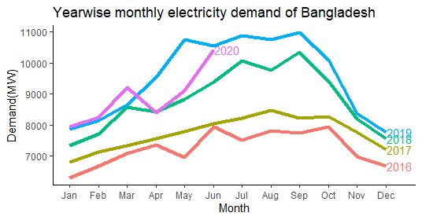
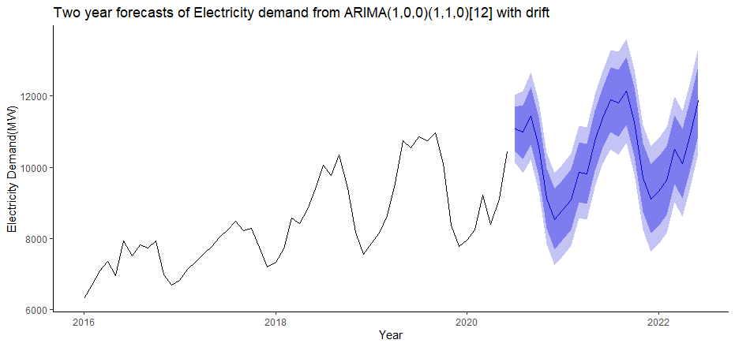

---
# Abstract

We examine the long-run relationship between tourism development and economic growth using the Nonlinear Autoregressive Distributed Lag (NARDL)
model for Bangladesh using annual data from 1980 to 2016. We find an asymmetric relationship between tourism and Bangladesh’s economy since
a 1% increase in tourism receipt increases economic growth by about 0.19%. On the contrary, due to a 1% decline in the tourism receipt, economic
growth will decrease by about 0.66%. So, the decline in tourism receipt will have a higher negative impact on economic growth than the increase in
the tourism receipt in Bangladesh, which result is important for current pandemic situation in tourism due to Covid-19. We also reveal that the impact
of positive change in the tourism revenue on GDP stabilizes around 8 years; however, an adverse change on GDP does not stabilize in 15 years. We
recommend that a systematic allocation of resources is required to promote and stimulate the tourism industry in Bangladesh for a favourable impact
on the country’s long-run economic development.
---

## IMPACT OF COVID-19 IN BANGLADESH ENERGY SECTOR
To observe the Covid-19 pandemic effect on
Bangladesh's energy sector, the seasonal electricity
demand from 2016 to 2020 is shown in Figure 7. The
figure depicts the seasonality features and increasing
trend in electricity demand since 2016. However, the
To observe the Covid-19 pandemic effect on
Bangladesh's energy sector, the seasonal electricity
demand from 2016 to 2020 is shown in Figure. The
figure depicts the seasonality features and increasing
trend in electricity demand since 2016. 

However, the situation is different in the case of 2020. The electricity
demand in March 2020 is found to be higher than in
2019. However, it has started declining sharply from
April 2020, and till June 2020 (at the time of writing this
paper), it is still lower than the 2019 level. This is due to
the fact that Bangladesh declared a nationwide general
holiday on March 24. However, electricity demand is
catching up at a high rate because of the relaxation of
general holiday measures in the subsequent period, and
in June 2020, it is just below the 2019 level.

In this paper, we have used SARIMA (1, 0, 0) (0,
1, 0) [12] model 2 to generate a counterfactual value of
electricity demand for Bangladesh during the lockdown
period, using pre-general holiday (January 2016 to
March 2020) electricity data. The SARIMA (1, 0, 0) (0,
1, 0) [12] model is revealed as the best model in the
auto.arima function of R. Instead of traditional BoxJenkins methodology, auto.arima is a function of
forecast package, which uses corrected Akaike
Information Criteria (AIC) to select the order of ARIMA
models and it uses an algorithm, created by Hyndman
and Khandakar [38]. It runs a series of different ARIMA
models and chooses the best fitted ARIMA model by
corrected AIC.

