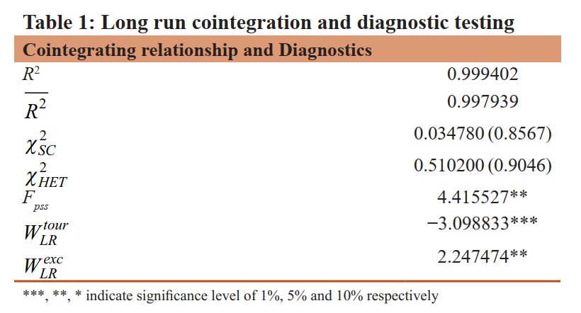
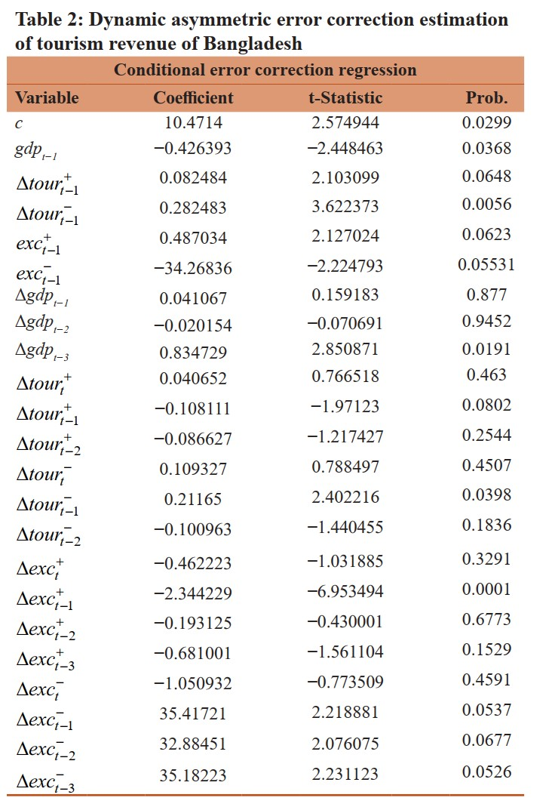
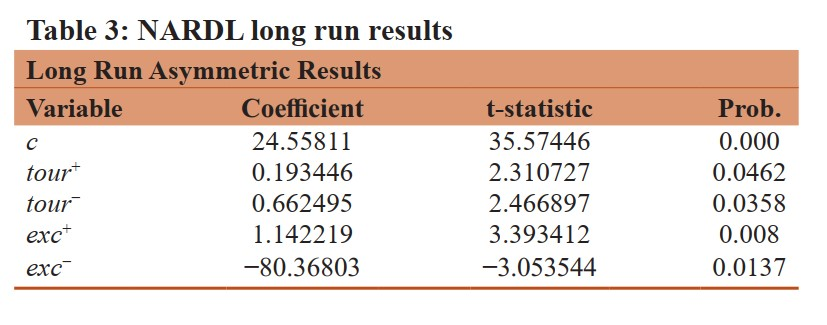

------------------------------------------------------------------------

# Abstract

We examine the long-run relationship between tourism development and economic growth using the Nonlinear Autoregressive Distributed Lag (NARDL) model for Bangladesh using annual data from 1980 to 2016. We find an asymmetric relationship between tourism and Bangladesh's economy since a 1% increase in tourism receipt increases economic growth by about 0.19%. On the contrary, due to a 1% decline in the tourism receipt, economic growth will decrease by about 0.66%. So, the decline in tourism receipt will have a higher negative impact on economic growth than the increase in the tourism receipt in Bangladesh, which result is important for current pandemic situation in tourism due to Covid-19. We also reveal that the impact of positive change in the tourism revenue on GDP stabilizes around 8 years; however, an adverse change on GDP does not stabilize in 15 years. We recommend that a systematic allocation of resources is required to promote and stimulate the tourism industry in Bangladesh for a favourable impact on the country's long-run economic development.

------------------------------------------------------------------------


# Methods

Following Amin (2010), we have considered following model to addressing our questions in this paper,

$$gdp_t = \alpha_0 + \alpha_1 tour_t + \alpha_2 exc_t + \epsilon_t$$

Where gdp is the GDP of Bangladesh, tour is the tourism receipt of Bangladesh and exc is the exchange rate of Bangladesh. All the variables are taken from 1980 to 2016, and they are converted into the natural logarithmic form to make this model into an elasticity model. This paper augmented Amin's paper by using the exchange rate to examine how inbound tourism depends on the exchange rate. This is because if the exchange rate is higher or depreciates, that will make a country's tourism cheaper than the competing countries (Ertugrul and Mangir, 2015; Husein and Kara, 2020).

The nonlinear ARDL model had some advantages over the ARDL model that is used in Amin (2010). The main drawback of this ARDL model was it assumes a symmetric relationship that means the rate at which GDP increases due to a rise in tourism is the same as the rate of GDP decreases due to tourism decrease. Similarly, like the ARDL model NARDL model is free from residual correlation and endogeneity of regressors. Also, the NARDL model exhibits long run and short run cointegration regardless of the variables I(0), I(1), or integrated at the same order. Unlike the ARDL model, the NARDL model discerns the asymmetric adjustment of the regressors' positive and negative shocks on the explained variable. That means this model can detect if there are any long run and short run asymmetry in the model.

Following, Shin et al. (2014), we will use nonlinear ARDL (p, q1, q2) model as follows,

$$ gdp_t = \sum_{j=1}^p \phi_j gdp_{t-j} + \sum_{j=0}^{q_1} (\theta_j^{+} tour^{+}_{t-j} + \theta_j^{-} tour^{-}_{t-j}) + \sum_{j=0}^{q_2} (\eta_j^{+} exc^{+}_{t-j} + \eta_j^{-} exc^{-}_{t-j})+ \epsilon_t $$

Here, $\theta_j^+, \theta_j^- , \eta_j^+$ and $\eta_j^-$ are the associated asymmetric long run parameters and $\epsilon_t$ is an $i.i.d.$ process with zero mean and finite variance. $p$, $q_1$ and $q_2$ are lag orders and $tour_t(= tour_0 + tour_t^+ + tour_t^-)$ and $exc_t (=exc_0 + exc_t^+ + exc_t^- )$ are vectors with $k\times1$ dimension, entering the model asymmetrically. $tour_t^+$ and $tour_t^-$ denoting the partial sums of positive and negative changes in tourism revenue. Same is true for $exc_t^+$ and $exc_t^-$ This model of partial sum decomposition can be written in the following form,

\begin{equation}\label{tourPSD}
tour_t^{+}= \sum_{j=1}^t \Delta tour_j^+  =  \sum_{j=1}^t max(tour_j, 0)
\end{equation} \begin{equation}
tour_t^{-}= \sum_{j=1}^t \Delta tour_j^-  =  \sum_{j=1}^t min(tour_j, 0)
\end{equation}

\begin{equation}\label{excPSD}
exc_t^{+}= \sum_{j=1}^t \Delta exc_j^+  =  \sum_{j=1}^t max(exc_j, 0)
\end{equation} \begin{equation}
exc_t^{-}= \sum_{j=1}^t \Delta exc_j^-  =  \sum_{j=1}^t min(exc_j, 0)
\end{equation} Equation \ref{mainNARDL} can be formulized into a conditional nonlinear error correction model(ECM) in the following format,

```{=tex}
\begin{multline}\label{nonlinearECM}
\Delta gdp_t = \rho \xi_{t-1} + \sum_{j=1}^{p-1} \delta_j \Delta gdp_{t-j}+ \sum_{j=0}^{q_1 - 1} (\pi_j^+ \Delta tour_{t-j}^+  + \pi_j^- \Delta  tour_{t-j}^- )\\
 + \sum_{j=0}^{q_2 - 1} (\lambda^+ \Delta exc_{t-j}^+  + \lambda^- \Delta  exc_{t-j}^- ) + e_t
\end{multline}
```
Where, $\rho = \sum_{j=1}^p \phi_j - 1$ and $\xi_t = gdp_t - \alpha^+ tour_{t}^+ - \alpha^- tour_{t}^- - \beta^+ exc_t^+ - \beta^- exc_t^-$ is the non-linear error correction term where, $\alpha^+ = - \theta^+ / \rho$ , $\alpha^- = - \theta^- / \rho$, $\beta^+ = - \eta^+ / \rho$ and $\beta^+ = - \eta^- / \rho$. Also, $\sum_{j=0}^{q_1 -1} \pi^+$ and $\sum_{j=0}^{q_1 -1} \pi^-$ shows short run influences of increase and decrease of tourism revenue on GDP. Similarly, $\sum_{j=0}^{q_2 -1} \lambda^+$ and $\sum_{j=0}^{q_2 -1} \lambda^-$ shows, influences of increase and decrease of exchange rate on GDP.

Therefore equation \ref{nonlinearECM} can be framed into nonlinear ARDL-based ECM in the following format.

```{=tex}
\begin{multline}\label{nARDL}
\Delta gdp_t = c + \phi_j gdp_{t-j} + \theta_j^{+} tour^{+}_{t-j} + \theta_j^{-} tour^{-}_{t-j} + \eta_j^{+} exc^{+}_{t-j} + \eta_j^{-} exc^{-}_{t-j}\\
 + \sum_{j=1}^{p-1} \delta_j \Delta gdp_{t-j}+ \sum_{j=0}^{q_1 - 1} (\pi_j^+ \Delta tour_{t-j}^+  + \pi_j^- \Delta  tour_{t-j}^- ) + \sum_{j=0}^{q_2 - 1} (\lambda^+ \Delta exc_{t-j}^+  + \lambda^- \Delta  exc_{t-j}^- ) + e_t
\end{multline}
```
In equation 8c is the restricted constant. This is the case-2 of conditional error correction model (CECM) by Pesaran et al. (2001). The value of $\theta^{+},\theta^{-},\eta^{+},\eta^{-}$ in equation \ref{nARDL} should be positive. As, the positive value of $\theta^{+}$ shows, as tourism revenue increases, GDP would increase and positive value of $\theta^{-}$ show as tourism revenue decreases GDP would decrease too. This is what tourism led growth hypothesis or growth led tourism hypothesis suggests. Same way positive value of $\eta^{+}$ and $\eta^{-}$ shows that if exchange rate increases that means exchange rate depreciates against the dollar, which makes tourism in BD cheaper which in turn creates GDP to increase.

To see if there is any long-run relationship or cointegration among these variables we will first apply F-statistics from equation 8, where our null hypothesis is there is no cointegration that is ($H_0 : \phi = \theta^+ = \theta^- = \eta = 0$). Then to ensure this cointegration is not nonsensical cointegration or degenerate cointegration normally t-bounds statistics of Banerjee et al (1998) is used. However, in case the data generating process(DGP) has a trend or a constant then t-test can not be used. After that, we used null hypothesis of long run symmetry of GDP using the wald test. Which uses a $\chi^2$ distribution with null hypothesis that there is no difference between $\theta^+$ and $\theta^-$ that is $H_0: \theta^+ = \theta^-$.

# Results

Even though it is not necessary for the variables to integrated at the same order for NARDL model, but if there is any variable which is I(2) then the model would be invalid. Therefore, we first checked the unit root test and found that there is no variable, which is integrated at I (2).


From Table 1 we see that value of $F_{PSS}$ statistic is significant at 5% level. Therefore, it is definite that there is a cointegrating relationship among these variables. Also, from the table, $\chi^2_{SC}$ and $\chi^2_{HET}$ are the serial correlation test and heteroskedasticity test for the residuals, respectively. In the serial correlation test, the null hypothesis is there is no serial correlation in the residuals, and in the heteroskedasticity test, the null hypothesis is that residuals are homoskedastic. Both of these tests can not reject the null hypothesis, therefore, we can safely say that this model's residual is linear uncorrelated and homoskedastic. Lastly, we can see that Wald test statistics for tourism are significant at 1% level, which means there is a significant asymmetric relationship between GDP and tourism revenue. From the Figure 1, we can see that recursive estimation using CUSUM and CUSUM of the square is within the 5% significance level, and therefore, the coefficients of this model are stable over the study period.





```
