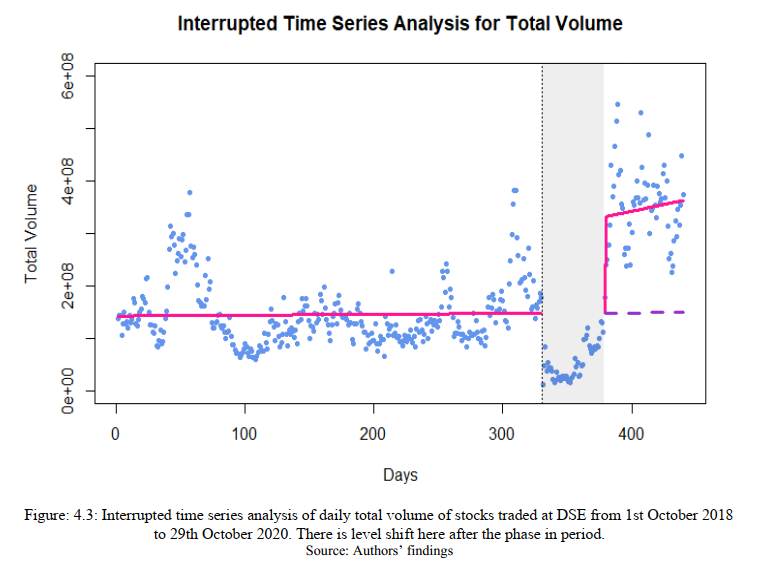
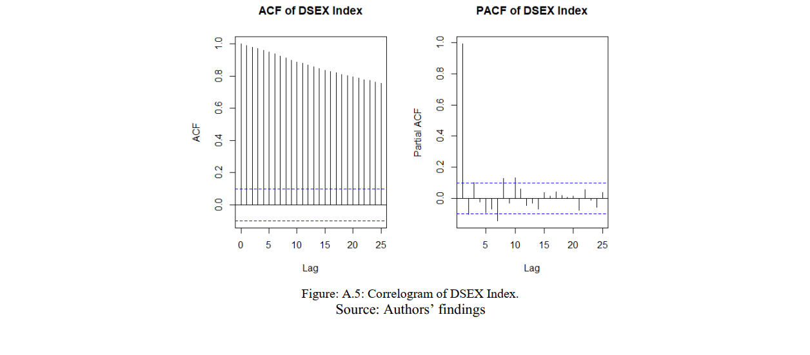

# Abstract

The modern economy is down to its knees due to the unprecedented event caused by Covid-19.
The capital market of Bangladesh had also encountered significant volatility due to this pandemic.
We employ the Interrupted Time Series (ITS) analysis, a robust quasi-experimental design, to
find out if there is a structural break in Bangladesh's capital market, initiated by Covid-19. To our
knowledge, this paper is the very first instance of using the ITS method for Bangladesh to
investigate the Covid-19 effect on the financial sector. This paper used five daily market summary
data: total trade of stocks, the total value of the traded stocks, total volume of the stocks, total
market capital and DSEX index from October 1, 2018 to October 29, 2020 to quantify the impact
of Covid-19. This study's results are very surprising as total trade, total value, and total volume
of stock have a significant positive level shift, and market capital and DSEX index have a
significant positive trend shift after the Covid-19 lockdown. These results can be explained by
the optimistic traders who gained confidence from the government's stimulus package, a record breaking number in remittance and reserve, and a relatively higher economic growth forecast than
Bangladesh's neighboring countries.

# Keywords: 

Interrupted time series, Covid-19 impact, Stock exchange, Structural break

# JEL Classification:

C22, C53, G01, G23

---

---

# 1. Introduction
The disastrous impact of the novel coronavirus, Covid-19, is seen in many sectors in economy like health,
education and financial sector and the overall economic welfare. Worldwide, people are concerned about
the likelihood of economic recession (Nicola et al., 2020) and long-term volatility in international trade and
stock market (Albulescu, 2020). According to Fernandes (2020), since the case of the Covid-19 outbreak
is being compared with the historical events of SARS, its impacts on the economy are subject to
underestimation. He also explains that although lockdown duration and the recovery time from this crisis
are unidentified, using different case scenarios, the economic cost of Covid-19 can be calculated. It is
expected that, in a mild scenario, Gross Domestic Product (GDP) will fall by about 3-6%, and in the worst
scenario, it will fall by about 10-15% depending on the size and economy of the underlying countries.
Globally, GDP will fall up to 2.5-3% for each additional month of crisis. Ozili and Arun (2020) highlights
two methods by which Covid-19 disrupted the world economy: first, the shutdown of financial markets due
to social distancing and lockdown and second, the raise of uncertainty. They also reveal that, as the number
of lockdown days increased, it severely affects economic activity and major stock market indices.

In Bangladesh, Covid-19 has exacerbated unemployment, food security, and financial market volatility
(Akter, 2020; Barua et al., 2020; and Uddin et al., 2020). From March 26, 2020, the Bangladesh government
had declared a nationwide general holiday to slow down the spread of Covid-19 (Barua et al., 2020). From
February 27 to June 10 in 2020, besides the daily market volatility of 2.20%, equities' market value has also
fallen by 11.50% (Barua et al., 2020). Due to increased uncertainty amid the current pandemic, investors
are less likely to buy new stock with increased risk and try to liquidate existing stock market assets to
survive this prolonged economic distress. New investment is also out of the question since consumption
demand fell and business activity has stopped for an unknown period (Barua et al., 2020). According to Mamun et al. (2018) stock market performance of Bangladesh has significant impact on the economy in
both short and long run. It is crucial to ensure a stable financial market as the market can affect the other
sectors of the economy, which is very common for financial market shocks(Gencer & Musoglu, 2014).
Since Bangladesh aims to become a high-nation country by 2041 and achieve the Sustainable Development
Goals (SDGs), this shock may delay the country's development targets.

Given this background, we aim to examine and analyze the trend of the stock market, specifically of the
Dhaka Stock Exchange (DSE), during this economic halt caused by the Covid-19 pandemic. The study
incorporated Interrupted time series(ITS) approach to analyze daily data on five (5) DSE indicators
representing the stock market activities. Total trade, total value and total volume taken to see the vitality of
the market. On the other hand, total market capital and DSEX index is taken to see the overall condition of
the market. The data span is from October 1, 2018 to October 29, 2020. The analysis is done from a positive
economic perspective. Use of ITS in identifying the impact of Covid-19 on the stock market of Bangladesh
is unprecedented. This research gap was the main inspiration in formulating this study. The findings of this
study are surprising. Although stock market indicators plummeted during the lock-down period, it is now
recovering at a more incredible speed than before. The probable explanation for these phenomena is the
optimistic view of investor and investee's future economic prosperity. The Government has also
implemented many incentives to tackle the adverse impact of Covid-19 on the economy to avoid long-term
recession, where the financial market also gets the spotlight. These may have positively influenced the
current growth of the stock market.

Finally, the paper is divided into five sections. The second section discussed the literature reviewed and
then find the research gap the study wants to address. The third section is for methodology, the fourth
section interprets the results and findings, and lastly, the fifth section concludes the study.

---

# 2. Literature Review

The worldwide economy is going through the crisis generated from fear and economic inactivity catalyzed
by the Covid-19 pandemic. Many researchers have pointed out that the global financial market is now
confronting an unfavorable time due to increased risk, nationwide lockdown, and uncertainty raised by the
news of new cases and the death of Covid-19. The summary of the literature is presented in Table 1 and
divided into three categories. The first category shows studies done worldwide discussing the impact of
Covid-19 on the stock market. The second category is for explaining how the Bangladeshi stock market
reacted during this pandemic situation and lastly, the third category is given to show justification of using
the ITS approach in analyzing the crisis of the stock market.

According to the literature review findings, the study to investigate the impact of Covid-19 on the
Bangladesh stock market is scarce. Moreover, the use of ITS in determining the stock market trend is not
new but is very limited. To the authors' knowledge, no study has used ITS to assess the impact of Covid-
19 on Bangladesh's stock market, more specifically, DSE.

In this regard, our objective is to find and determine the effect of Covid-19 on five stock market indicators,
namely, total trade per day, the total value of these trades, total volume of these trades, total market capital
and DSE general index (DSEX) using ITS method.

---

## 3. Methodology

Different experimental research designs found its way into the economics and policy studies from
the medical field, and one such successful example is a Randomized Control Trial (RCT) (Duflo &
Banerjee, 2011). RCT was first used in the medical field in 1948, but it only drew attention in policy studies
from the mid of 1990s and gained popularity since 2000 (Bouguen, Kremer, & Miguel, 2018). ITS is a
quasi-experimental design, which has been used in the medical literature from the 1960s (Shadish, Cook,
& Campbell, 2002). This is especially useful for finding out the causal relationship of the variables when
researchers are unable to do RCT and have no control over a historical event and policy intervention. ITS
has recently gained a tract in economics to find the causal impact of policy intervention.
This paper aims to use a single group ITS analysis on DSE's different market indicators, which represents
a summary of the market. In general, ITS analysis uses two groups; one is treatment, where policy
intervention happens, and another one is controlled, where there is no policy intervention. This paper does
not employ the latter group due to Covid-19's impact on every world's stock market. This paper uses the
following regression model for ITS:

Here,  is the share market indicator, where  can take the value of 1 to 5, as this paper uses five indicators:
i) total trade, ii) total value, iii) total volume, iv) total market capital, and v) DSEX index. Subscript 
represents the time at which these values were taken.  is the intercept, and  represents the trend before
Covid-19 incidence.  means no incidence of Covid-19 and  means the incidence of Covid-19.
Therefore,  represents the level of change due to Covid-19. Similarly,  is the change in trend due to
Covid-19. Four possible scenarios can arise from the impact of Covid-19; i) A level change, but the trend
of the indicator will remain same, ii) There will be a trend change for the indicator but no level change, iii)
both level and trend will change because of Covid-19, and iv) There will be no change in the indicators.

Due to the possible autocorrelation issue from the daily time series, data, the OLS estimators would not
provide the best linear unbiased estimators(BLUE). Thus, this paper examines each series' autocorrelation
function and partial autocorrelation function and finds the appropriate Autoregressive (AR) and Moving
Average (MA) order for each series. After figuring out these AR and MA terms, this paper employs a
Generalized Least Square (GLS) method, incorporating all the AR and MA orders into the OLS.

For this study, a threshold period needs to be set for before and during lockdown period. It is not virtually
possible to pinpoint the day from when the impact of Covid-19 on DSE started. This might be the day when
news of contagion in China published for the world, or the day when the world health organization (WHO)
declared covid-19 as a pandemic, or maybe the day at which the first Covid-19 patient was found in
Bangladesh. Examining the data, this paper takes days before March 18, 2020 as before the Covid-19 period
for DSE and the following period as during the Covid-19 period. The rationale behind selecting this specific
date is, on March 17, 2020 a general holiday was declared for all the educational institutes of the country
and a nationwide lockdown was expected from that day. Moreover, on March 18, 2020, the first case of
Covid-19 death has occurred. However, since we have taken daily data and has 440 data points (from
October 1, 2018 to October 29, 2020 excluding all the public holidays), the result will not be significantly
affected due to the selected starting date's approximation.

The next step is to set a phase-in period for the impact of Covid-19 on DSE. This period comprises
observations after the initial shock when either trend or level do not change arbitrarily until a pattern
emerges. In this paper, phase-in period is set from March 19, 2020 to July 29, 2020. As the market was
relatively unstable in June and July after the initial shock of Covid-19.

---

## 4. Result Analysis and Findings

Results from the analysis of the five indicators are presented in table 2. The correlogram used to detect the
order of the autoregressive process is given in appendix 1. The findings and implications of these results
are explained below, where sub-section 4.1 to 4.5 describe the ITS models of each indicators of stock
market and sub-section 4.6 explain the economic interpretation.

---

### 4.1 Total Trade

Using the correlogram of figure A.1 from Appendix-1, it can be identified that total trade uses an AR (6)
process. Therefore, GLS of total trade take in following format,

Table 2 shows that before Covid-19 incidence, the total trade trend per day was declining, and the trend
became positive after that period trend. However, neither before Covid-19 nor during the Covid-19 trend
are statistically significant. The important parameter here is the level change after the Covid-19
incidence, which is statistically significant. This means, after Covid-19, level of total trade change
increased by, on average, 62247 more trade per day. This result is presented in figure 4.1, where the
difference between counterfactual and actual values are presented, and a jump in level is apparent.

---

### 4.2 Total Value

Correlogram of figure A.2 shows that total value follows an AR (9) process. GLS of total value can be
written as,

The values are taken from table 2. Like, total trade, the total value of the daily transactions had a negative
trend before Covid-19. Unlike total trade, it is significant at the 10% level. However, the level change is
most prominent, which is significant even at the 1% level. This is illustrated in figure 4.2. In summary, on
average, after the phase-in period, the impact of Covid-19 on the total value of the traded stock increased
by 5670 million takas per day than before the Covid-19 period.

---

### 4.3 Total Volume

Correlogram of figure A.3 indicates that total volume follows an AR (9) process similar to the total value.
GLS regression can be written as follows

These values are taken from table 2. We can interpret that Covid-19 has a significant positive level effect
on the total volume of trades. Figure 4.3 illustrates the counterfactual and actual level change in the volume
of trade. This study concludes that after the phase-in period, on average, 183 million more stocks are traded
per day at DSE during the Covid-19 period.

---

### 4.4 Total Market Capital

Figure A.4 depicts the correlogram of total market capital of which indicates that total market capital
follows an AR (10) process. Therefore, the appropriate GLS is as following,

These values are taken from table 2 and illustrated in figure 4.4. It is clear that before the Covid-19 market
capital had a significant negative trend, there is a significant positive trend change after the phase-in period.
This paper used a non-linear form of the trend to fit data, which is not significant at the 5% level but significant at the 10% level (that is weakly significant). This means, even if before Covid-19, the market
was declining; after the phase-in period, market capital increased. The negative value of the trend square
term validates that market capitalization is increasing at a decreasing rate.

---

### 4.5 DSEX Index

Figure A.5 shows that the correlogram deduces that the DSEX index follows an AR (10) process, just like
that of total market capital.

DSE Index results from table 2 and figure 4.5 is very similar to that of total market capital. Even though
the DSEX index was declining before Covid-19, its trend reversed after the Covid-19 incidence. Like
market capital, the DSEX index, too, is increasing at a decreasing rate.

The level change in total trade, trade value, and trade volume signifies a more vibrant and dynamic market
than before. This change may be because the record amount of remittance is pouring in the country and an
increased reserve amount during the Covid-19 pandemic. Also, exports are recovering slowly, and the
economy as a whole shows progress. IMF declared a speedy recovery with only 1.7% GDP contraction,
whereas India is projected to contract 10.3% of its GDP (ref IMF paper).

According to Shehzad, Xiaoxing, and Kazouz (Shehzad et al., 2020) , even though the Covid-19 health
crisis has generated a financial crisis in the whole world, better prospects for portfolio optimization will
still be available in the Asian market. Both Ashraf (Ashraf, 2020) and Topcu and Gulal (Topcu & Gulal,
2020) explained that government-provided stimulus packages would positively influence stock market
returns by offsetting this pandemic's impact. They also emphasized government declarations regarding
public awareness programs, testing and quarantining policies (Ashraf, 2020), and official response time (Topcu & Gulal, 2020). In this sense, our study is in line with existing literature and gives evidence to the
policymakers' policy worldwide.

---

## 5. Conclusion

The paper aims to quantify the impact of Covid-19 on the stock market of Bangladesh using five stock
market indicators of DSE. For this purpose, the ITS method without using a controlled group is used, which
is a novel instance in the existing literature. The time used in the study is divided into two segment, the first
segment represents before Covid-19 situation (October 1, 2018 to March 18, 2020) and the second part
represents the pandemic state, that is during Covid-19 period (March 19, 2020 to October 29, 2020). A
phase-in period of two months (March 19, 2020 to July 30, 2020) is set to observe the first smack of Covid-
19 on the stock market.

Using the ITS analysis, this paper found that Covid-19 has a significant positive impact on DSE. There is
a significant upward shift of total daily trade, value, and stock volume. The market capital and DSEX index
showing a downward trend for the last two years has a significant positive trend because of different
government initiatives such as stimulus packages for export-oriented industries, monetary relief packages
to the poor, moratorium on loans. Moreover, period record-breaking remittances and reserves, and a
positive future outlook for the economy helped to make this turnaround possible.

In case of a second wave of Covid-19, government should initiate these policies again to boost up economy
as well as the capital market. Government can increase liquidity by printing more money and giving
adequate relief to the poor, and thus handle Covid-19 situation more efficiently to increase the morals of
the shareholders. If financial sector is stable, it will help to absorb the shocks from other sectors. Other
similar countries, which share same socioeconomic condition may adopt some these policies to avoid
consequences of a second wave of Covid-19 on the stock market.

---

# Reference

References

- Akhtaruzzaman, M., Boubaker, S., & Sensoy, A. (2020). Financial contagion during COVID - 19 crisis.
Finance Research Letters, (May), 101604. https://doi.org/10.1016/j.frl.2020.101604

- Aktar, M., Begum, H., & Sohag, A. (2020). Impact of COVID-19 on Stock market in Bangladesh . IOSR
Journal of Economics and Finance (IOSR-JEF), 11(4), 30-33. https://doi.org/10.9790/5933-
1104063033

- Akter, S. (2020). Covid-19 and Bangladesh: Threat of Unemployment in the Economy. 5. International
EMI Entrepreneurship and Social Sciences Congress PROCEEDINGS E-BOOK, 280.

- Al-awadhi, A. M., Alsaifi, K., Al-awadhi, A., & Alhammadi, S. (2020). Journal of Behavioral and
Experimental Finance Death and contagious infectious diseases???: Impact of the COVID-19 virus on
stock market returns. Journal of Behavioral and Experimental Finance, 27, 100326.
https://doi.org/10.1016/j.jbef.2020.100326

- Albulescu, C. T. (2020). COVID-19 and the United States financial markets ' volatility. Finance
Research Letters, (March), 101699. https://doi.org/10.1016/j.frl.2020.101699

- Ali, M., Alam, N., Aun, S., & Rizvi, R. (2020). Journal of Behavioral and Experimental Finance
Coronavirus ( COVID-19 ) - An epidemic or pandemic for financial markets. Journal of
Behavioral and Experimental Finance, 27, 100341. https://doi.org/10.1016/j.jbef.2020.100341

- Ashraf, B. N. (2020). Journal of Behavioral and Experimental Finance Economic impact of government
interventions during the COVID-19 pandemic: International evidence from financial markets.
Journal of Behavioral and Experimental Finance, 27, 100371.
https://doi.org/10.1016/j.jbef.2020.100371

- Azimli, A. (2020). The impact of COVID-19 on the degree of dependence and structure of risk-return
relationship: A quantile regression approach. Finance Research Letters, 36(June), 101648.
https://doi.org/10.1016/j.frl.2020.101648

- Bai, L., Wei, Y., Wei, G., Li, X., & Zhang, S. (2020). Infectious disease pandemic and permanent
volatility of international stock markets???: A long-term perspective. Finance Research Letters, (May),
101709. https://doi.org/10.1016/j.frl.2020.101709

- Baig, A. S., Anjum, H., Haroon, O., Aun, S., & Rizvi, R. (2020). Deaths , panic , lockdowns and US
equity markets: The case of COVID-19 pandemic. Finance Research Letters, (April), 101701.
https://doi.org/10.1016/j.frl.2020.101701

- Barua, S., Alam, A., Rahman, I., & Hossen, A. (2020, July). Mapping the Covid-19 implications for
Bangladesh's stock market. The Financial Express.

- Bernal, J. L., Cummins, S., & Gasparrini, A. (2017). Interrupted time series regression for the evaluation
of public health interventions: a tutorial. International Journal of Epidemiology, 46(1), 348-355.

- Bouguen, A., Kremer, M., & Miguel, E. (2018). Using RCTs to Estimate Long-Run Impacts in
Development Economics.
Cepoi, C. (2020). Asymmetric dependence between stock market returns and news during COVID-19
financial turmoil. Finance Research Letters, 36(June), 101658.
https://doi.org/10.1016/j.frl.2020.101658

- Chiah, M., & Zhong, A. (2020). Trading from home???: The impact of COVID-19 on trading volume
around the world ???. Finance Research Letters, (September), 101784.
https://doi.org/10.1016/j.frl.2020.101784

- Duflo, E., & Banerjee, A. (2011). Poor economics. PublicAffairs.
Erdem, O. (2020). Freedom and stock market performance during Covid-19 outbreak. Finance Research
Letters, 36(May), 101671. https://doi.org/10.1016/j.frl.2020.101671

- Fernandes, N. (2020). Economic effects of coronavirus outbreak (COVID-19) on the world economy.
Available at SSRN 3557504.

- Gencer, H. G., & Musoglu, Z. (2014). Volatility transmission and spillovers among gold, bonds and
stocks: An empirical evidence from Turkey. International Journal of Economics and Financial
Issues, 4(4), 705-713.

- Just, M., & Echaust, K. (2020). Stock market returns , volatility , correlation and liquidity during the
COVID-19 crisis: Evidence from the Markov switching approach. Finance Research Letters,
(September), 101775. https://doi.org/10.1016/j.frl.2020.101775

- Lyocsa, S., & Molnar, P. (2020). Stock market oscillations during the corona crash: The role of fear and
uncertainty. Finance Research Letters, 36(June), 101707. https://doi.org/10.1016/j.frl.2020.101707

- Mamun, A., Ali, M. H., Hoque, N., Mowla, M. M., & Basher, S. (2018). The causality between stock
market development and economic growth: Econometric evidence from Bangladesh. International
Journal of Economics and Finance, 10(5), 212.

- Masserini, L., & Matilde, B. (2017). Impact of the 2008 and 2012 financial crises on the unemployment
rate in Italy: an interrupted time series approach. Conference of the Italian Statistical Society
(Statistics and Data Science: New Challenges, New Generations), 1-8. Firenze University Press.

- Narayan, P. K., Phan, D. H. B., & Liu, G. (2020). COVID-19 lockdowns , stimulus packages , travel bans
, and stock returns. Finance Research Letters, (August), 101732.
https://doi.org/10.1016/j.frl.2020.101732

- Nicola, M., Alsafi, Z., Sohrabi, C., Kerwan, A., Al-Jabir, A., Iosifidis, C., . Agha, R. (2020). The socioeconomic implications of the coronavirus pandemic (COVID-19): A review. International Journal
of Surgery (London, England), 78, 185.

- Okorie, D. I., & Lin, B. (2020). Stock Markets and the COVID-19 Fractal Contagion Effects. Finance
Research Letters, 101640.

- Ozili, P. K., & Arun, T. (2020). Spillover of COVID-19: impact on the Global Economy. Available at
SSRN 3562570.

- Salisu, A. A., & Vo, X. V. (2020). International Review of Financial Analysis Predicting stock returns in
the presence of COVID-19 pandemic: The role of health news. International Review of Financial
Analysis, 71(June), 101546. https://doi.org/10.1016/j.irfa.2020.101546

- Shadish, W. R., Cook, T. D., & Campbell, D. T. (2002). Experimental and quasi-experimental designs for
generalized causal inference/William R. Shedish, Thomas D. Cook, Donald T. Campbell. Boston:
Houghton Mifflin,.

- Shehzad, K., Xiaoxing, L., & Kazouz, H. (2020). COVID-19 ' s disasters are perilous than Global
Financial Crisis: A rumor or fact? Finance Research Letters, 36(June), 101669.
https://doi.org/10.1016/j.frl.2020.101669

- Topcu, M., & Gulal, O. S. (2020). The impact of COVID-19 on emerging stock markets. Finance
Research Letters, 36(May), 101691. https://doi.org/10.1016/j.frl.2020.101691

- Uddin, M. N., Alam, B., Islam, S. K. S., Arif, M., Alam, M. M., & Kabir, S. M. L. (2020). Impact of
COVID-19 on food safety and security in low and middle income countries. Asian Journal of
Medical and Biological Research, 6(2), 130-137.

- Wooldridge, J. M. (2016). Introductory econometrics: A modern approach. Nelson Education.

- Zhang, D., Hu, M., & Ji, Q. (2020). Financial markets under the global pandemic of COVID-19. Finance
Research Letters, 36(March), 101528. https://doi.org/10.1016/j.frl.2020.101528

---

# Appendix 1

---

