# Abstract

The paper presents an application of a discrete choice experiment that aims to find out the preferences of the online classes to ensure efficient learning. The experiment method is employed to identify the key attributes of online classes that the students prefer the most. The specific focus in the study was the students of Bangladesh University of Professionals (BUP), which has been the forerunner in Bangladesh in taking online classes since the beginning of Covid-19 at tertiary level. Data has been collected from a sample of 243 BUP students. The findings suggest that optimal learning is ensured when interrupted video on the study topic is provided prior to a 30-60-minute-long discussion between the students and teachers on the same topic. Students have also shown a preference for the usage of Digital Whiteboard as the lecture conduct method. The result has policy implications in ensuring effective online education in nontechnical subjects at the tertiary level. The optimum model can be replicated during educational disruption due to natural disasters and even in areas difficult to access, like hill tracks of Bangladesh.

---

---
#### Keywords

COVID-19, Education, Tertiary level, Online learning, Preference, Attributes, Discrete Choice
Experiment, Conditional Logit Model

#### Jel Classification

C87, C61, H12, I21, I26, I28

---

# 2 Introduction

The Coronavirus pandemic has changed the course of human history. Even in November 2019,
handshakes were a meet and greet thing, but now it has turned into a death weapon. Six feet
distance became the new norm and classroom education was halted at all levels. As the global
academic calendar slowly plunged into a state of disarray, concerned authorities began
experimenting with online learning. Since the beginning of the global pandemic, 41.9 million
learners in Bangladesh have received online education at some level, over a million of whom are
at university level (S. Shafia; I. Javed).

The challenge was unprepared for from both ends. The immediate suspension of university classes
of the campuses worldwide has expanded the virtual distribution of a vast number of courses. In
India, students are using various platforms for online lectures, study material sharing and learning
evaluation, such as the Zoom app, Team link, YouTube live, Skype, Google meets/hangout,
Google classroom, WhatsApp, etc. (Kapasia et al., 2020). China has already developed an
online classroom hosted on the cloud, which has received widespread praise (Dhaka
Tribune, August, 2020).

The case is specifically challenging for developing nations. Bangladesh, being a disaster-prone
nation, often faces educational disruption. Government has been thinking about e-learning for
quite some time now. With the outbreak of COVID-19, the situation became a must. Upon closure
of universities, many institutions started altering their educational policies to prevent students from
falling under the vicious trap of session jam. By now, most universities have started taking online
classes. However, online classes have seen significantly lower numbers of attendance. To top it
off, Bangladesh lacks an inclusive technological infrastructure that can bring digital education to
every doorstep. With only 64.8% internet penetration, the government of Indonesia has rolled out
an online Learning System Program (SPADA) which supports various LMSs across
universities of the country, but Bangladesh has still not taken any such measure (Dhaka
Tribune, August, 2020).

The pandemic induced crisis situation has added more to our screen time, necessitated the use of
expensive technological devices, limited interaction with near and dear ones which have all
culminated into high anxiety and stress level for many students. At the beginning of the online
learning process, it was the only way out to the students and the educators to keep the education
going. Since it has been a while and a good number of students are involved in the process now, if
we try to evaluate, in many cases, we see that we shifted the physical learning process to the online
platforms without understanding the characteristics of distance learning much. The goal of
education should not only be limited in imparting knowledge, but also in making sure the receivers
are well equipped to take the lessons in. Which is why it is crucial that an optimum online
education module is established keeping in mind the resources available to an average student in
Bangladesh during crisis.

With this aim, this paper identified several attributes of online education to elicit students'
preferences in the context of COVID-19 at tertiary level. The study was conducted online over a
period of three months on the students at Bangladesh University of Professionals (BUP), a public
university in the Cantonment area of the capital. Alongside analyzing their preferences through a
Discrete Choice Experiment, regular interaction was maintained with the respondents to better
understand the rationale behind their choices. Up until the time of the experiment, no such study
had been conducted in Bangladesh. Educators are also aware of the limitations of the students.
However, it is a very new situation for them too. Thus, a general guideline about the new situation
is timely and relevant. With all information duly gathered, we have established an optimum online
module for the tertiary level. It should be noted that, BUP has four different faculties that house
16 departments in total. The optimum model established through our paper can be implemented to
any tertiary student body with departments like that of BUP. It is most applicable for departments
under business and social science. Although, Medical and Engineering subjects have not been
included in the study, the same methodology can be applied to study their preferences too. The
result and implications might vary.

The paper first outlines background study on COVID-19 and worldwide response to it, be it policy
implications or the fight against lowering the number of infected people itself. The focus, however,
has been kept on the comparison of educational changes and its shift to online platform. A good
deal of explanation has also been given on the theoretical framework of the paper for the ease of understanding. The paper goes on to mention about the methodology of the research including data
collection, processing, and modelling. The result and limitation are kept at the very end to bring
everything together.

---

# 3 Background Study

## 3.1 Exposure of COVID-19

The coronavirus, which emerged in December 2019 in China, has spread to almost every region,
bringing life to an end, and derailing the global economy. Up until January 2021, the virus has
infected over 106,358,244 million people and caused the death of around 2 million people
(Worldometer). During the uphill struggle, even the most strong and influential has fallen into the
grasp of the virus. The condition was so dire that it was declared a global pandemic by the World
Health Organization.

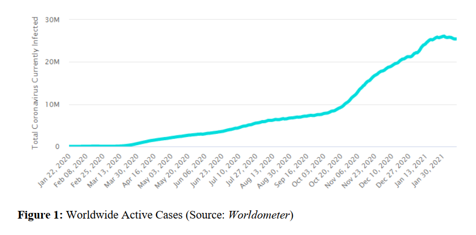

In early December 2020, nations started the race to procure vaccines and, to get the virus under
control. A few western countries began administering shots to their most vulnerable population.

Following is a brief timeline of the outbreak -

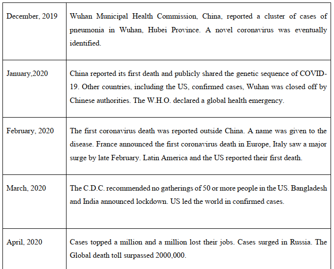

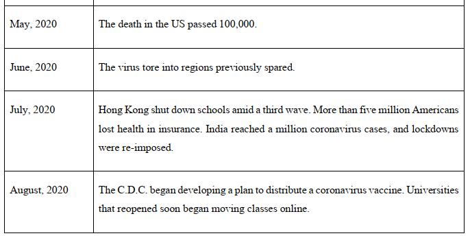

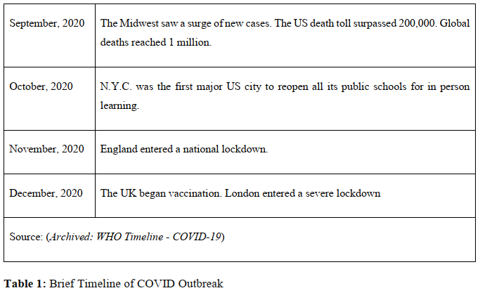

However, the surge in the disease was not the same across continents. While Europe, Asia and
North America could be termed as the worst sufferers of the pandemic, Africa and Oceania was
relatively less affected.

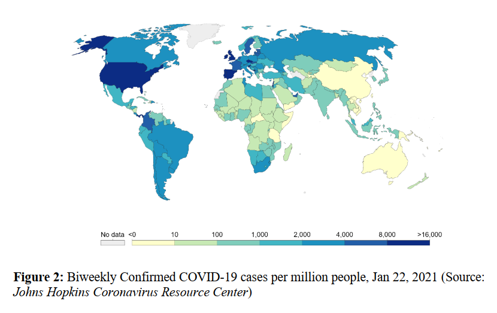

---

# 4 COVID-19 in Bangladesh

## 4.1 Emergence & Cases

In Bangladesh, first COVID 19 cases were found on March 8, 2020. Two men and a woman aged
20-35 years who came from Italy were found COVID positive (Anadolu Agency, March 2020).
As of February 6, 2021, total COVID cases are 537,770, deaths are 8,190 and total recovered cases
are 482,841 in Bangladesh (Worldometer). Soon after the news of detecting the first COVID
positive patient was aired, debates over the decision of shutting down populated places such as
educational institutes and factories became an active concern. After two weeks of uncertainty, the
Bangladesh government declared a 10-day general holiday from March 26 to April 4 to curb the
spreading. Emergency services and production were kept open only. The general holiday was
extended up to May 30 in six phases and 13-point instruction was announced (Anadolu Agency,
March 2020). The instructions were compiled as-

- Elderly people, pregnant women, and those who are sick will not have to attend the
office.

- All educational institutes will remain closed till June 15. But classes can be taken online.

- Public transports, including rail and waterways transports, will remain suspended. The
private airlines, however, can operate following proper safety measures.

- The movement of vehicles from one district to another will also be restricted. The law
enforcers are setting up checkpoints at all entrance and exit points of the districts.

- All public gatherings and meetings will also remain banned until further notice.

- Mosques and other religious places will remain open while complying with health
regulations.

- Shops have been allowed to remain open, from 10 am to 4 pm, following all the health
guidelines.

---

## 4.2 Economy of Bangladesh during COVID-19

As a middle-income country, Bangladesh soon felt the sharp blow of COVID-19 when the
International Monetary Fund expressed its concerns over the fact that the country's GDP growth
could come down as low as 2 percent (Dhaka Tribune, April 2020). A research by SANEM on the
economic impact of COVID-19 predicted that as many as 40.9 percent of the population would go
below the poverty line (The Daily Star, April 2020). The worst sufferers of the whole situation
were the ones involved in the informal economy. Besides them, the RMG and Agricultural sector
went through significant turbulence too. Following graph illustrates the effect on Bangladesh's
different sectors during COVID induced lockdown from the beginning of March until May 30 of
2020 -

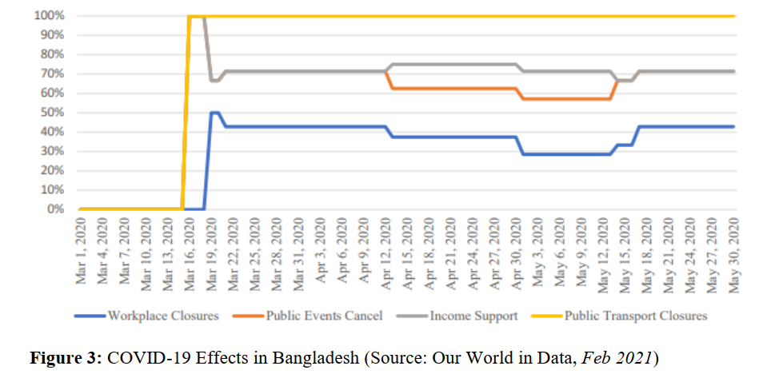

### 4.2.1 Ready Made Garments Industry

Bangladesh is the second largest RMG exporting country in the world and the industry contributed
11.17% to the gross domestic product of the country in the year 2017-18 (Dhaka Tribune, April
2019). 61% of 4.1 million workers in RMG are women. The sector was on the verge of facing a
business catastrophe during COVID- 19 as many buyers were canceling or postponing orders due
to substantial shut down of retail outlets throughout the megacities of Europe, North America, and
Asia. According to Bangladesh Garment Manufacturers and Exporters Association, international
buyers have either canceled or suspended $3.16bn worth of shipments involving 1,142 factories
affecting 2.26 million workers as of 18 April 2020 (Asian Development Bank, 2020). According
to a survey conducted by BRAC University, 47% of RMG workers reported not receiving their
wages and felt uncertain about their current job status with their respective employers ( The Daily
Star,April 2020). Nearly 1 million workers were laid off in a few months (NPR, April 2020).

### 4.2.2 Agricultural Sector and Supply Chain Collapse

In 2019, the share of agriculture in Bangladesh's gross domestic product was 12.68 percent
(Statista, November 2020). There was no lack of production in the agricultural sector but due to
social distancing and decreased mobility of transportation has caused disruption of the supply
chain and a reduction of the mobility of labor during the Boro harvesting season.

### 4.2.3 Informal Economy and Reverse Migration

In Bangladesh, 87 percent of the labor force is employed in the informal economy (ILO). Those
working in the informal economy include wage laborers, self-employed persons, unpaid family
labor, piece-rate workers, and other hired labor mostly in the urban area. Most of them have little
to no savings. The prolonged general holiday and social distancing had brought income erosion
that led them to reverse migration. There is no available survey conducted to determine the
nationwide migration due to COVID induced holiday. It is also undetermined that what portion of
the reverse migrated people have lost the ability to migrate back immediately after the situation
turns normal. However, a collaborative study conducted by the Power and Participation Research
Centre (PPRC) and the BRAC Institute of Governance and Development (BIGD) has come out
with a representative percentage of reverse migration during the shrinkage of livelihood options.
The study finds that in April last 6.0 percent of low-income people left Dhaka for their village
homes and by June, the percentage of returnees increased to 15.64 percent (The Business Standard,
June 2020).

---

## 4.3 Government's Combat Policy to Restrain Economic Crisis

At first on 19th March, 2020, Bangladesh Bank announced a moratorium on loan payments until
30th September 2020 so that borrowers will not be in default. The Bangladesh Government
announced details of its BDT 50bn stimulus package for export-oriented industries at the end of
March. This included assistance towards salaries and funding of 2-year loans to factory owners at
2% interest.

On April, 2020, Prime minister announced another stimulus package of BDT 677.5bn which was
planned to implement in immediate, short and long phases through four programs, while on 13th
April, another direct cash assistance of BDT 7.6bn for informal sector workers was announced
(KPMG International, 2020). A total of 18 economic sectors, including export-oriented industries;
small, medium and cottage industries, agriculture, fish farming, poultry and livestock have been
brought under these incentive packages. Among the packages, the highest amount of BDT 300bn
has been allocated for providing working capital facilities to the affected industries and services
sector organizations.

Since the outbreak of the pandemic, the Government has largely focused on mechanization of
agricultural works worth BDT 2bn, alongside an agricultural subsidy worth BDT 95bn. Farmers
were also given low rate interest at only 4 percent to safeguard against their feared fallouts. Under
a cash assistance program by the Government announced on May 14, 2020, 5 million families
received BDT 2,500 taka each. To assist students under the Madrasa curriculum, the Government
allocated BDT 170 million, for both students and teachers. For youths and expatriates who have
abruptly lost their jobs, BDT 25bn was given to Palli Sanchay Bank, Probashi Kallyan Bank and
Palli Karma Shayak Foundation (New Age, June 2020). programs have been reported to be
corrupted, but the government has not acknowledged anything so far.

---

## 4.4 Education during COVID-19 in Bangladesh

As soon as the disease started spreading worldwide and transmission became accelerated rapidly
schools and universities across the world began to close gradually. The unprecedented event of a
global pandemic has rendered almost 41.9 million learners out of education, over a million of
whom are in university level (British Council). Soon after, the decision to proceed with education
over online medium came into light. A few institutions at secondary level started taking online
classes as early as from the 3rd week of April, one month after the closure of nationwide secondary
schools on 18 March 2020. Class attendance, however, has been very low.

After the first detection of Covid-19 in Bangladesh on March 8, the Education Ministry suspended
activities of all educational institutes from March 18 to 31. The suspension has been prolonged
several terms. A decision was made by the Education Ministry in January 2021 which instructed
schools and colleges to be prepared for reopening by February 4th (Dhaka Tribune, January 2021).
However, no final decision has been made in this regard.

### 4.4.1 Primary & Secondary Education

On 25 August, the Ministry of Primary and Mass Education announced the cancelation of Primary
Education Completion (PEC) and equivalent exams; followed by the decision to cancel JSC on
August 27. This year about 3 million examinees were expected to take the PEC exam and 2.5
million were expected to sit for the JSC exam (The Daily Star, August 2020). On October 2020,
Government finally decided to cancel Higher Secondary Certificate and its equivalent exams and
to evaluate the examinees based on their SSC and JSC results (Dhaka Tribune, October 2020).

Shortly after exposure to the pandemic, the Government of Bangladesh tapped on these already
available training and resources. An initiative was taken upon to broadcast pre-recorded secondary
level school lessons titled 'My School at My Home' in national television channels with the help
from a2i. The Directorate of Secondary & Higher Education had started airing lessons for
secondary level students of classes VI-X from the end of March. In contrast to it, China has already
developed an online classroom hosted on the cloud, which has received widespread praise. The
Chinese are also using the state television to broadcast lessons to reach students without internet
access (Dhaka Tribune, August 2020).

At secondary level, educators are using combinations of different teaching methods such as lecture,
discussion, demonstration, and group work to conduct online classes. A research conducted by 4
faculty members from Institute of Education and Research, University of Dhaka and Green
University of Bangladesh, found that 35 among 54 secondary level teachers under study used
lecture methods to conduct classes. Besides, 18 teachers mentioned the use of a peer discussion
method alongside lecture to elaborate the topics. Some teachers have been uploading PowerPoint
slides, images, and different web links to their social media groups beforehand for students to
acquire prior knowledge on the subject.

### 4.4.2 Tertiary Education

As for tertiary level, there are forty-six public and one hundred five private universities in
Bangladesh with approximately 676,000 and 350,000 students, respectively (BANBEIS, 2018).
According to information obtained from Bangladesh's University Grants Commission (UGC), up
until June only seven out of 46 public universities were running academic activities online
(University World News). With time, almost all universities have started taking online classes.

The challenge might be unprepared for. But shifting to a digital mode of education has long been
on the to-do list of our government. To bolster the educational backbone, more than 35,000
multimedia classrooms had already been set at primary and secondary level, alongside internet
connectivity (Education - a2i, 2021). Government has been quite regular in arranging ICT training
to create quality educators who are familiar with technical aspects of digital education. Moreover,
Shikkhok Batayon has been undertaken to bring all subject based knowledge under a single source.
Moreover, Bangladesh Open University has been the forerunner in digital education where printed
material is provided to students and classes are delivered over radio and TV. However, taking
online classes from the comfort of homes, with minimal resource availability and preparation, is a
totally unprecedented challenge to most teachers in Bangladesh. For Bangladesh, with over a
million students studying a variety of subjects at tertiary level, it seems quite impossible to bring
all information in one table. By now, all private universities and most public universities have
started taking online classes.

Brac University has already set an example in terms of delivering e-learning. The university has
created a platform named buX on a world-class platform developed by Massachusetts Institute of
Technology (MIT) and Harvard University. Part of buX's functionality is to enable online learning
even with bad connectivity. Moreover, the university has already waived all non-tuition fees of the
Summer 2020 session for every student. A student assistance fund has been established to provide
financial aid to students suffering due to the on-going pandemic.

Green University of Bangladesh, another renowned university on the private arena, has taken the
initiative of training its faculty members on Zoom, the preferred application for conducting online
classes as per the E-learning policy of the university (Dhaka Tribune). In an online discussion
titled 'Continuing academic activities online in higher education institutions' organized by British
Council's Higher Education team in Bangladesh, Hasan Al Zubayer Rony, Coordinator, Green
University Centre of Excellence for Teaching and Learning spoke about the initiatives taken with
regards to ensuring quality education online. He mentioned that Green University has formed an
E-learning committee to actively work on the development of a platform for conducting online
classes, assessment and evaluation, and monitoring and administration.

To take the case of ULAB, it had made initial investments in online learning as early as in 2007.
By 2014, ULAB had rolled out "Moodle," a well-known learning management system (LMS),
which faculty members were using in conjunction with face-to-face classes. All faculty members
were required to undergo Moodle workshops even before COVID-19.

Once the pandemic broke out, ULAB put together a capacity-building committee for students,
alongside arranging faculty development workshops on Google Classroom and Zoom for teaching.
(Dhaka Tribune) Research was also conducted by ULAB's Student Affairs Office to understand
students' access to technology and the internet, so that teaching methods could be adjusted
accordingly.

Most public universities, however, started online education a little late. Despite the University
Grants Commission making Zoom accounts free for all university teachers, challenges remain to
students' end. Shiblee Noman, lecturer in journalism and media studies at Jahangirnagar
University, has observed a maximum attendance of 60 percent students during Zoom lectures. The situation is even direr in universities outside Dhaka. The anthropology department of the
University of Rajshahi has seen 40 percent participation of students; while 50 percent of teachers
of the department have reported not being ready to deliver lectures on the internet (The Business
Standard, August,2020).

One university that stands out among all 46 public institutions is BUP and its affiliated sections.
BUP has been very prompt in taking online lectures as a course of action during pandemic. Despite
facing several challenges, the university has been successful in resuming full-fledged academic
activities from July, with assessment and assignments being duly assigned to students via Google
Classroom. The university has made conducting online classes mandatory for all faculties via
preferred medium like Zoom, Google Meet or even Facebook Live. Yasin Shafi, Lecturer at BUP,
told Dhaka Tribune that the university has been helping students by buying mobile internet
packages for them, so they do not have to venture outside (Dhaka Tribune, August 2020). A key
point to be noted here is that complaints remain on students' end as many of them struggle with
network stability and access to devices.

---

## 4.5 Chronicle of Online Class in Bangladesh

In this regard, Ministry of Education and ICT Division, a2i is working on the development of a
virtual classroom platform to provide universities with an online Learning Management System
(LMS) specifically tailored to meet the needs of learners in Bangladesh to continue regular
academic activities such as assessment, quiz, assignment, exam to help in mimicking a traditional
classroom (British Council). Moreover, Microsoft and many other developers provide efficient
tools for e Learning, such as Microsoft Digital Whiteboard and Blackboard to name a few. Some
universities have incorporated these tools into their education system. Alongside all of this,
Professor Mahbub Ahsan Khan from University of Dhaka has highlighted the importance of
maintaining a reasonable teacher student ratio during an online class for most effective learning
(S. Shafia; I. Javed).

---

# 5 Literature Review

Online education, however, is not a completely new thing in Bangladesh. Platforms such as 10-
Minute School and Khan Academy had already transcended traditional schooling schemes to
impart education for everyone. The platforms were individualized and chosen in a small range.
However, with the onset of the global pandemic, education has now moved completely online.

In China, the first country to be hit by the virus, platforms such as Ding Ding, Fanya, WeChat and
other office meeting software tools have gained popularity among teachers as online education
tools due to ease of using (Chen et al., 2020). India has a similar picture to that of Bangladesh.
Classrooms have shifted to Zoom, Skype, YouTube Live, Google meets to not only teach and learn
but also to assess students' progress (Kapasia et al., 2020). A research conducted on 232
undergraduate and postgraduate student of West Bengal, India found that, most of the respondents
(34.2%) used the Zoom app for attending e-lectures, followed by Google classroom (33.4%) and
YouTube live (14.7%). The research also found that learners were more willing to go through
shared study materials on their own than attending online classes, mostly due to poor internet
connection. For this purpose, 39.4% opted for WhatsApp group, while 31.8% of students used
Google Classroom (Kapasia et al., 2020).

Given the sensitivity of this issue, several studies have been conducted both nationally and
internationally to understand the effectiveness of these platforms as tools for online education.
(Chen et al., 2020) established an e-learning satisfaction evaluation model in the context COVID-
19 by examining aspects of interaction quality, service quality, availability, and personal factors.
The study used various tests to validate their findings. NLPIR-Parser (Natural Language
Processing and Information Retrieval) was used to conduct user emotion analysis regarding
different platforms. Validity Test and Reliability Test was duly conducted to ensure stability and
consistency of questionnaire data.

The study found that population under study experienced different levels of emotional problems
due to home isolation and financial factors, thus affecting the effectiveness of online learning. It
was also shown that interaction quality, service quality and availability of e-learning platforms had
positive influence on user satisfaction while personal factors had negative influence. Several other
studies support this result. Prolonged school closures and home confinement have been found to significantly hamper children's physical and mental health. The "psychological impact of
quarantine is wide-ranging, substantial and can be long-lasting".

In the case of adults, social impacts of the pandemic have been found to result in stress, depression,
and anxiety (Kapasia et al., 2020). Many families are experiencing reduction in family income
amidst COVID pandemic. This could mean the education continuation for many students. Sapkota,
P. P. (2020) took internet connectivity, availability of devices and adequacy of IT skills as other
determinants of mental stress. Being a developing country in the global arena, Bangladesh is far
from developing an inclusive technological infrastructure that ensures stable internet connectivity,
device with camera and microphone for everyone. As of now, only 60% of people in Bangladesh
have access to the internet, 92% of whom are using mobile internet (BTRC,2020). Internet speed
also varies widely between urban and rural areas (Sohail,2020). For this reason, some students
prefer pre-recorded videos of lectures because it allows them to study by themselves anytime. Price
of internet and minimum required gadgets for participating in online classes is also beyond the
reach of most of the students in Bangladesh For a student attending 3 classes per day, he/she will
need to spend around 1GB of data, which sums up to BDT 1000 per month (The Business Standard,
June 2020).

The study also found that most students have been spending more than 4 hours each day in front
of the screen solely for educational purposes. On days an assignment or home task is assigned,
students have to sit in front of the screen for additional hours to get the work done. Moreover, they
now have to rely on the internet to stay connected with their friends and family, which adds even
more screen time each day. In short, most work in a day now require staring at a screen. This could
be highly detrimental to our overall health. A 2017 study on U.S. adults found that spending six
hours or more a day in front of a screen could result in significant social, psychological, and
occupational impairments (Time, 2020). According to Psychology Today, an online website, an
average human should not spend more than 2 hours each day staring at any screen. In certain cases,
up to 4 hours could be considerable. For this reason, many students now prefer shorter classes.

Georgia has made it a government decree to adjust online class duration in a way so that prolonged
contact with the screen can be avoided (Basilaia and Kvavadze, 2020). Additionally, lesson hours
have been fixed keeping large breaks in between. Subject number has also been reduced at school
levels to give students enough chance to cope with the new situation.

In Bangladesh, teachers are using a variety of methods including PowerPoint slides, Microsoft
Digital Whiteboard to deliver their lectures. While it is possible to attend online lectures on
smartphones, unavailability of a laptop or computer poses significant barriers to reading slides or
following digital Whiteboards on screen. Nevertheless, the usage of visuals makes the lectures
more interesting for some students. With all this debate on hand, we now need an optimum model
for online learning, which can be implemented as a general guideline for conducting class. All the
studies conducted so far focused on finding statistics regarding which platform is being used more
or what challenges the students are facing on a regular basis. In this paper we aim to find the
preferred online learning dynamics of the current learners to design the most preferred online class.

We have used Discrete Choice Experiment to model our preference equation. Discrete Choice
Experiments are used to analyze consumer preference and their choices in the sectors of education,
health, and marketing. However, for the difficulty on understanding the model, not many papers
have used the model so far. From the paper we have found, Xue Gong (2015) used Discrete Choice
Experiment on international migration of Chinese students to identify the key factors underlying
students' international education choices. The findings suggest that university ranking and
destination safety are key decision drivers for Chinese students. (Gong and Huybers, 2015)

As for Bangladesh, no Discrete Choice Experiment has yet been conducted in the education field,
but one study conducted on maternal health services has used a Discrete Choice Experiment to
elicit women's preferences by showing them choice scenarios representing hypothetical health
facilities with nine attributes (Mahumud et al., 2019).

---

# 6 Theoretical Framework

As the focal point of this study, we have considered the preferences detailed by students of BUP
who have actively taken participation in online classes. It is highly crucial that the students have
at least 4 months of online class experience prior to the survey to be able to state their preference
properly and this fact was duly kept in mind all throughout. In Discrete Choice Experiments,
individuals select one alternative from a set of alternatives, each of which is expressed by a bundle
of attributes, thereby revealing important attributes/levels affecting the individual's selection. An
"attribute" is a characteristic or feature of an alternative, while a "level" or "attribute level"
represents the numerical or qualitative value of the attribute in each alternative. An "alternative"
is a combination of attributes; that is, one alternative can have two or more attributes. A choice set
includes two or more alternatives with at least one attribute having different levels between
alternatives, and possibly including an opt-out alternative. Respondents are usually asked to select
their most preferred alternative from a choice set. A choice set can be referred to as the set of
alternatives available to individuals.

The idea of Discrete Choice Experiment was largely developed by Thurstone (1927) and Marschak
(1960). Over the years, the derivation of the model underwent several changes from Binary Probit
Model to Random Utility Model (RUM). The derivation using Random Utility Model assures that
DCE is consistent with utility maximization. The models can also be seen as simply describing the
relation of explanatory variables to the outcome of a choice, without reference to exactly how the
choice is made.

In a RUM, a decision maker, labeled n, faces a choice among J alternatives, each giving a certain
level of utility. The utility that decision maker n obtains from alternative j is 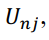, for all j = 1,...,
J . As a rational decision maker, the respondent will choose alternative i if and only if 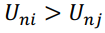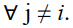. The researcher observes attributes of the alternatives, labeled 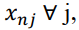, and some attributes
of the decision maker, labeled , and can specify a function that relates these observed factors to 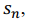
the decision maker's utility. The function is denoted 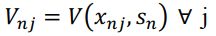 and is often called
representative utility. Usually, V depends on parameters that are unknown to the researcher and
therefore estimated statistically. Since there are aspects of utility that the researcher does not or
cannot observe, 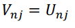

Therefore, utility is decomposed as

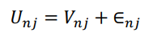
where 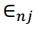 captures the factors that affect utility but are not included in 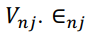 is defined as
simply the difference between true utility 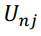 and the part of utility that the researcher captures in
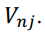 Researcher's specification of 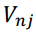 determine the characteristics of 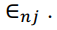 . The researcher does
not know 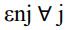 and therefore treats these terms as random. The joint density of the random vector
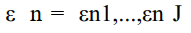 is denoted 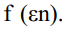. With this density, the researcher can make probabilistic
statements about the decision maker's choice. The probability that decision maker n chooses
alternative i is

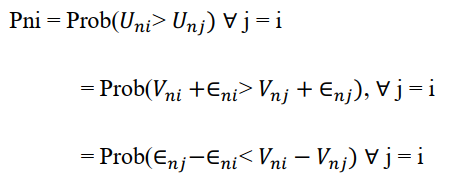

To apply logit function on the Random Utility Model equation 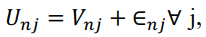 we assume
that each  is an independently, identically distributed extreme value. This independence means
that the unobserved portion of utility for one alternative is unrelated to the unobserved portion of
utility for another alternative.
An application of Discrete Choice Experiment can be summarized in three steps: (1) examining a
hypothetical situation and creating a DCE design; (2) preparing and conducting a questionnaire
survey; and (3) preparing a data set and conducting an analysis.
As a first step, the DCE user must consider the situation where respondents will make a choice.
Considerations in describing this situation include: (1) Giving clarity to the situation; (2)
Separating the alternatives; (3) designating attributes of the alternatives and attribute levels; (4)
deciding whether an opt-out option is included in the choice set; and (5) selecting the number of
alternatives per choice set. The alternatives must be mutually exclusive, exhaustive, and finite from
the decision maker's perspective. Previous research papers, expert opinions, fieldwork, and pilot
surveys are necessary to ensure the newly designed model is free of miscalculations.

The second step in implementing a DCE is to prepare and conduct a questionnaire survey. This
step includes creating a questionnaire; determining a sample size; selecting a survey mode; and
sampling the respondents from the sampling frame. As the final step, the user must prepare a
data set from the valid samples and conduct a statistical analysis based on the data set. Since, in
DCE, respondents reveal their preference, the dataset is different from usual ones. In addition, the
structure often differs according to the software package used for DCE analysis.

---

# 7 Methodology

As stated, we have adopted Discrete Choice Experiment to conduct our study. Using a choice
experiment comprises of four stages: (a) Determination of attributes and attribute levels, (b)
Survey design, (c) Data collection and (d) Modelling.

## 7.1 Determination of Attributes and Attribute Levels

For this survey, we have selected four key attributes, namely 'Lecture Type', 'Lecture Duration',
'Class Conducting Method' and 'Study Engagement'. All four attributes are categorical. The
attributes have several levels included in them. We are avoiding 5 points Likert scale and open ended questions to prevent biases and redundancy.

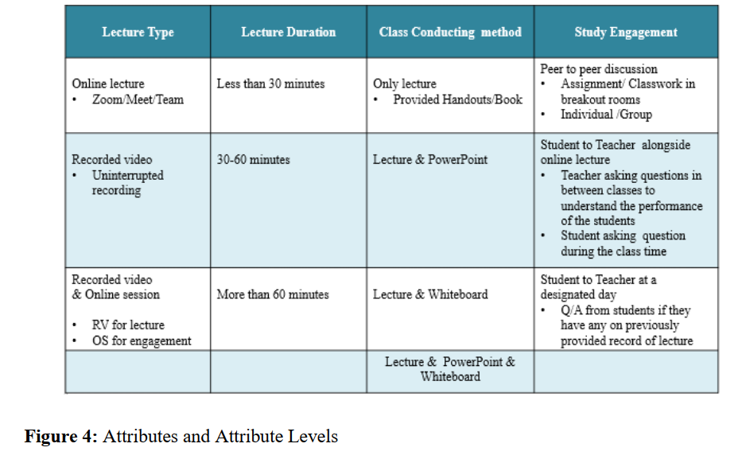

We then construct the following Conditional Logit model

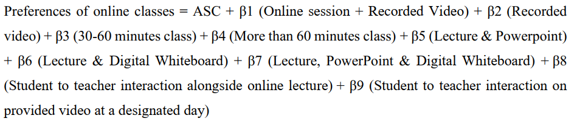

Here, ASC refers to an alternative-specific constant which is similar to a constant in a regression
model and shows the average effect on utility of all the factors that are not included in the model.
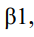, coefficient of variable 'Online session + Recorded Video', is equal to 1 if the attribute Lecture
Type is 'Recorded video + online session' and 0 otherwise; 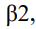 coefficient of variable recorded
video, is equal to 1 if the attribute Lecture Type is 'Recorded Video' and 0 otherwise; 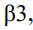
coefficient of variable '30-60 minutes class' is equal to 1 if the Lecture Duration is '30-60 minutes'
and 0 otherwise; 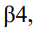 coefficient of variable 'More than 60 minutes', is equal to 1 if the Lecture
Duration is more than 60 minutes and 0 otherwise; 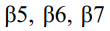 are the coefficients of variables
'Lecture & PowerPoint', 'Lecture & Digital Whiteboard' and 'Lecture, PowerPoint & Digital
Whiteboard' respectively denoting the class conducting method, and 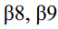 are the coefficients of
variables 'Student to teacher interaction alongside online lecture' & 'Student to teacher interaction
on provided video at a designated day' denoting the attribute study engagement.

---

## 7.2 Survey Design

The attributes were then randomly assigned to make two choice sets with R (version 3.6.2). In this
process we have used the 'questionnaire()' function to convert a DCE design created by one of the
functions 'rotation.design()' into a typical DCE questionnaire. We had a total of 36 questions in
the outcome, which were equally divided into three sets. In these questions, students were asked
to compare two hypothetical class scenarios. For example -

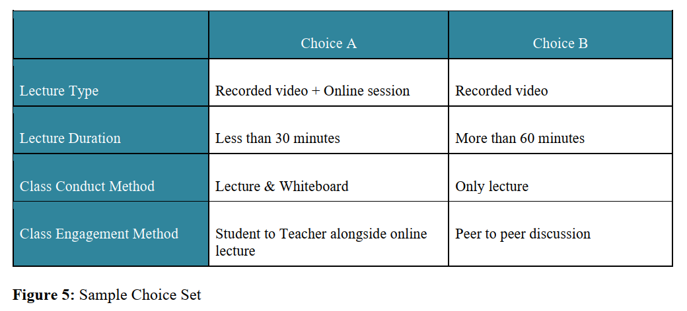

---

## 7.3 Data Collection

Bangladesh University of Professionals has been one of the forerunners in the race of online class
at tertiary level in Bangladesh. The public university run by Bangladesh Armed Forces had shifted
its courses online from the very beginning of COVID-19 outbreak in Bangladesh. For practical
purposes, we have selected students of BUP as our study population. As students of the same
institution, we also have proper domain knowledge to understand the ins and outs of the
preferences listed by the students of this institution. The university has a mix of students from
different social class and corners of the country. The result can be applied to any institution with
a similarity to BUP in terms of student body and departments. It is most applicable for students
studying subjects related to business and social science.

With 16 departments under 4 different faculties, BUP houses over 6050 students. The university
has four batches in each department under bachelors' program, while some departments also have
an operational master's program. With a 10% error level and confidence interval of 90%, the
sample reflecting the accuracy of the population is 240, but we have collected 243 responses to be
on the safe side.

The three sets were assigned to five departments each. No response was found from the department
of ICE. The respondents were first added to a group chat and given a brief explanation of the
survey. They were later invited to a zoom call where they were again cleared out of any confusion.
They were instructed to stick to their preference only and not think about others. With consent
from all participants, we then sent out the questionnaire and collected data. In total, we had about
243 survey responses. Following is a department and batch wise breakdown of our respondents

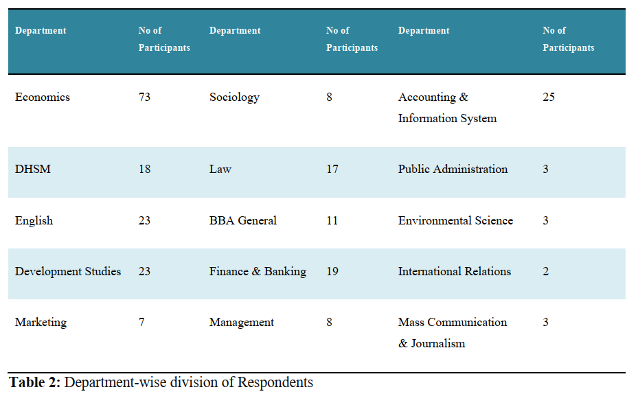

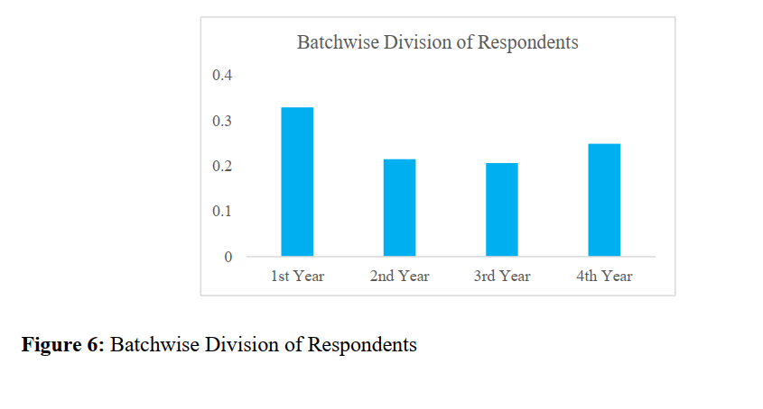

---

## 7.4 Modelling

The results from the three sets of questionnaires were then merged into one excel file which was
later imported into R (version 3.6.2). With required packages installed, we then turned our excel
file into a matrix format. The 'make.design.matrix()' function converts a DCE design into a design
matrix that is suitable for Conditional Logit model analysis. The matrix format was later
transformed into a data set to construct a Conditional Logit model using 'clogit()' function. Finally,
'stargazer' package was used to view the result of the model.

---

# 8 Result

We ran the data in R to receive the result shown in the figure below. All variables here are
categorical. Hence, one variable for each attribute was taken as the base value and others were
calculated in terms of it.

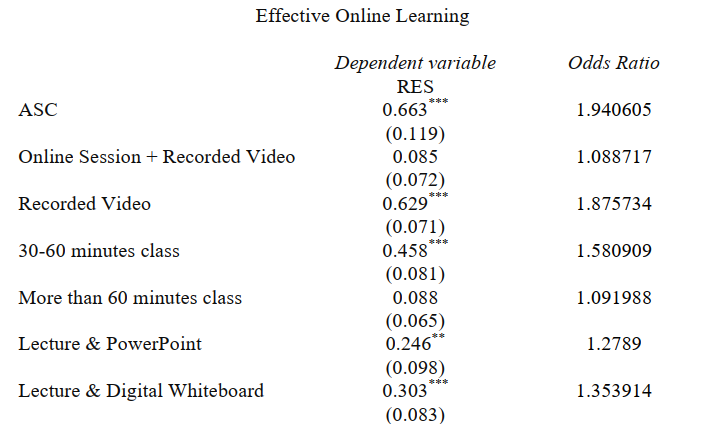

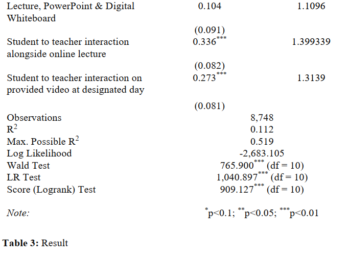

With appropriate coefficients, our Preference of online class is represented in terms of the
following Conditional Logit Model, in which the attribute levels are used as variables:

Preferences of online classes = 0.663 + 0.085 (Online session + Recorded Video) + 0.629
(Recorded video) + 0.458 (30-60 minutes class) + 0.088 (More than 60 minutes class) + 0.246
(Lecture & PowerPoint) + 0.303 (Lecture & Digital Whiteboard) + 0.104 (Lecture, PowerPoint &
Digital Whiteboard) + 0.336 (Student to teacher interaction alongside online lecture) + 0.273 (
Student to teacher interaction on provided video at a designated day)

Conditional logit models are appropriate when the choice among alternatives is modeled as a
function of the characteristics of the alternatives, rather than the characteristics of the individual
making the choice (Hoffman and Duncan, 1988). There are, however, two fundamental limitations
of the conditional logit model. First, the model assumes that choice questions measure utility
equally well across all respondents. Second, conditional logit does not account for unobserved
systematic differences in preferences across respondents (Hauber et al., 2016). Newer techniques
are being developed to overcome the limitation, but for our case, Conditional Logit Model is the
most appropriate one.

---

## 8.1 Findings

Estimation results for our model is shown in Table 3. It should be noted that, most of the variables
here are significant at varying significance levels, with the exception of (1) Online Session +
Recorded Video, (2) Class more than 60 minutes and (3) Class conducted using Lecture +
PowerPoint + Digital Whiteboard. They all have expected signs before them as well. The R-squared value of .112 is reasonable although not very high.
Under lecture type, online lecture via Zoom/ Google Meet/ Microsoft Teams was taken as the
benchmark. Since most institution has adopted this method as their prime mode of education,
measuring the effectiveness of other methods on the basis of Online Lecture is justified. For this
reason, Lecture type specific coefficients are estimated only for Online lecture + Recorded Video
and Recorded video. These coefficients capture all intrinsic lecture type specific effects on
preference. From the table 3, we can see that Online Lecture + Recorded gives the students .085
more utility compared on online lectures alone. In this case, lectures are first taken online using 

preferred platform which are recorded and provided to all students to watch according to their
convenience. The method is effective for students who struggle with internet connectivity or
cannot attend the class for different reasons. This is why it is more preferred than Online lectures
only, but the incremental value is not significant. However, the recording does not include only
the lecture, but also queries by other students. While this may be very effective, irrelevant
questions or gossip can divert the attention of the student watching it later.

On the other hand, recorded video is highly preferred by the students. Here, recorded videos refer
to prerecorded video by the teacher. Online lecture will also be taken at a regular basis. The
difference between 'Online Session + Recorded Video' and 'Recorded Video' is that in case of
the former, a recorded clip of the online discussion is provided after lecture, while in the case of
the latter, a prerecorded video is provided prior to the regular lecture. The incremental value for
'Recorded Video' is .629 and it is highly significant. When prerecorded videos are provided the
students have an opportunity to study the topic beforehand. They can also adjust the speed and
video quality based on their limitation. Interrupted video also solves the problem of inefficiency
from irrelevant question that divert attention, a major drawback of 'Online Session + Recorded
video'. During the regular online class, students can interact with their teacher and clear out their
confusion.

Using a conditional logit model in which the dependent variable is the natural logarithm of the
odds of choosing one alternative over a base alternative, the exponential of the coefficient
estimates for each attribute level under lecture type can be used to determine the odds of each type
of lecture type being chosen. These are shown in Table 3.

The odds ratio for the Online Session + Recorded Video is 1.088717 and for Recorded video alone
is 1.875734, as opposed to Online Lecture, which is set at 1. These values are utility measures for
these lecture types holding everything else constant. Therefore, the likelihood of selecting a
particular lecture type can be estimated as its utility relative to the sum of utilities of all three
options, which in the case of 'Online Session + Recorded Video' is
1.088717/(1.088717+1.875734+1) = 0.1825. The ratio is case of 'Recorded video' is .3145, which
means Recorded video alone is most likely to be chosen.

For Class Duration, classes less than 30 minutes were taken as the base value. In BUP, most online
classes lasted more than 60 minutes, except for few special cases, where classes lasted less than
30 minutes. Surprisingly enough, students found classes less than 30 minutes to be very short to
grasp the topic. They strongly preferred the classes to be slightly longer than 30 minutes, but below
60 minutes. The incremental value was .458 and it is highly significant. If the class is a little
detailed, the students find it easier to understand the topic side by side clearing out their confusion.
Classes more than 60 minutes, however, are less preferred to classes between 30 to 60 minutes,
but still higher than below 30 minutes by .088 units, but the value is not significant. If the classes
are too prolonged, it begets an opportunity cost that the students could use otherwise; hence, it is
less preferred.

The odds value for Classes between 30 to 60 minutes is 1.580909 and that of classes more than 90
minutes is 1.091988. The likelihood of selecting classes between 30 to 60 minutes is 1.580909/
(1.580909 + 1.091988 + 1) = 0.4308, while that of classes more than 60 minutes is 1.091988/
(1.580909 + 1.091988 + 1) = 0.2973. Thus, we can say that the likelihood of selecting classes
between 30 to 60 minutes is the highest.

Class can be conducted using only lecture, lecture with PowerPoint, and lecture with digital
Whiteboard or all three together. For mathematical purposes, we are taking only lecture based class
as our base. As we can see, usage of PowerPoint and Digital Whiteboard is preferred by students.
They both give a rise of .246 and .303 in utility respectively. Digital Whiteboard is preferred more,
because the students can actively see the breakdown or formation of equations/ theories, while in
PowerPoint they see premade contents. Both the values are statistically significant, but PowerPoint
and Digital Whiteboard together are preferred less by students compared to PowerPoint or Digital
Whiteboard alone. The combination of two is still more preferred to lectures alone by .104 units.
Frequent shifts between software create a disruption in the flow of class. Concentration during
online class, once lost, is very hard to regain and students find it hard to understand next topics.
The usage of both methods requires frequent shifts in screen color, which is harmful for the eye to
adjust during prolonged classes, especially if someone suffers from migraine issues. The value,
however, is not significant even at 90% significance level.

The odds value for Class conducted using Lecture with Digital Whiteboard and PowerPoint both
is 1.1096, while that of Digital Whiteboard and PowerPoint individually is 1.353914 and 1.2789,
respectively. Using the same formula as stated before, the likelihood of selecting Lecture with
Digital Whiteboard and PowerPoint is 0.2340. The value is quite less when compared to the
likelihood of other two attribute levels, which stand at 0.2855 (Digital Whiteboard) and 0.2697
(PowerPoint). The very close likelihood value of the two attributes point to the fact that, students
prefer visuals when it comes to online class because it makes lessons more appealing and easier to
remember.

Lastly, as the base for class engagement method, we have taken 'peer to peer discussion' where
the students discuss the topic among themselves in separate breakout rooms (only available in
zoom and Microsoft Teams). From the table above, we can see that other engagement methods are
more preferred to it. Student to Teacher discussion alongside online lecture is the most preferred
of the three and gives .336 units of added utility and the value is highly significant. This method
allows the students to directly discuss with the teacher whenever any confusion arises, and it can
be solved almost immediately. This fact was also resonated in the students' preference towards
'Recorded Video' under the attribute of 'Lecture Type'. If a regular online class is taken where the
topic is explained in brief in addition to providing the prerecorded video, the students can go
through the topic again for a better understanding. In case of discussion on a designated day,
lectures are arranged occasionally. So, the students have to store questions and discuss it later with
the teacher. While this may also solve the confusion, there is a chance that the student might forget
parts of the topic and struggle to communicate about the confusion properly. Students also find it
hard to study further before the designated day because some confusion may be intricately related
to next topics. Thus, discussion on designated day is less preferred by students but still gives .273
units more utility than peer to peer discussion, because peer to peer discussion is effective only
after proper understanding of lecture by every student, not before that.

The odds value for Student to teacher discussion alongside online lecture/ recorded video both is
1.399339, while that of Student to teacher on a designated day is 1.3139. The likelihood of picking
student to teacher interaction alongside online lecture/ recorded video is 0.3769 and that of student
to teacher interaction on a designated day is equal to 0.3538.

The likelihoods, calculated for individual attribute levels, can be used to draw a preference graph.
Here, the x-axis plots the attributes while the y-axis plots the likelihood. The vertical length of the
bars signifies preference level. A higher length means a higher preference.

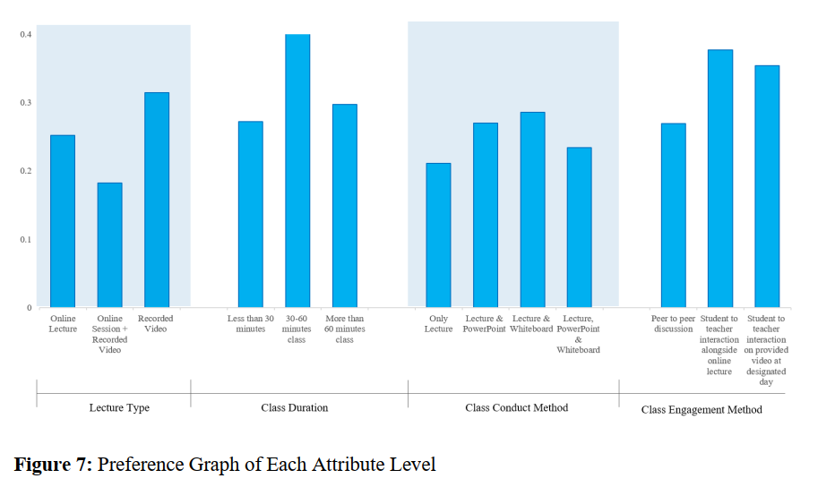

The constant coefficient, given by Alternative Specific Constant (ASC), is equal to .663. This
means that all else held equal, if a student is faced by all those attribute levels which we have taken
as benchmarks for separate attributes, his/her preference will be equal to .663 utils. All other
variables are measured as an increment or decrement to this value. The coefficient is highly
significant at 99% level.

---

# 9 Limitation

The situation was particularly tough when we started collecting data. Due to the ongoing social
distancing, we had to get most of our works done online and many of the departments were not
done with their final exam up until we collected responses. Because of that, we found higher
proportion of actively concerned respondents from a few departments. Besides, choice
experiments are usually conducted through Focused Group Discussions, so that the researcher can
rightly understand the motive behind respondents' choices. However, to overcome this problem,
we maintained personal connections with our respondents and limited our study to students at Bangladesh University of Professionals only, as we have adequate domain knowledge here. If
situation allowed, we could have extended this study to students of other universities too to get a
more comprehensive result. The result will still not be as accurate as it would have been if done
offline.

Prior to our study, no research on online education during COVID-19 had been conducted. This
limited us in our quest for data and information. The only source of information that allowed us to
be regularly updated was newspaper article. A few English newspaper published a number of
articles by independent writers on different aspects of COVID-19 which came in handy for our
information collection. However, a few newspaper websites were allegedly giving out fake
information. Which is why, we had to limit out study to Dhaka Tribune, The Daily Star and The
Business Standard only. These pages also had active e-portals, which was our only way to regular
updates about COVID and its effect on different sectors during lockdown.

Another problem we faced is that of filtered response, which we could easily get rid of by getting
a spontaneous response offline. Some participants chose multiple options when they were
undecided between the options, instead of opting out. Since this went directly against our research
policy, we had to leave out the responses. We tried maintaining our diligence all throughout.

---

# 10 Conclusion

Preference on the online class attributes is a complex choice to make as it involves a student's
socio-economic background, country's internet infrastructure, humans perceived psychology and
associated mental and physical health alongside multiple attributes of online classes itself. Our
study has tried to identify the contributing factors to the effective online classes for Bangladeshi
students. We have used the application of a discrete choice experiment method to bring out the
true preferences students make based on other exogenous variables.

Our analysis has found the model that optimizes students' utility in case of online education. The
students prefer interrupted recorded video on the study topic prior to a 30-60-minute-long
discussion between the students and teachers on the same topic. The lecture is most effective when
it is delivered using digital Whiteboard. These are not any universal choice that maximize utility
the most but this can contribute to a bring a significant change in online education in Bangladesh.
It also comes down to individual educators to consider his or her students' capability to take lessons before overwhelming them with topics they do not understand. It not only affects their mental
health, but also severely damages their confidence. At the very last, we can conclude that the
efficiency in online education revolves around optimum screen time. While our study shows it as
a contributing factor, our findings also point to the fact that lecture duration plays a vital role when
it is online education.

---

# 11 Bibliography

- Bangladesh - share of economic sectors in the gross domestic product 2019 | Statista (no date).
Available at: https://www.statista.com/statistics/438359/share-of-economic-sectors-in-the-gdpin-bangladesh/ (Accessed: 7 February 2021).

- 1 Million Bangladeshi Garment Workers Lose Jobs Amid COVID-19 Economic Fallout:
Coronavirus Updates???: NPR (no date). Available at: https://www.npr.org/sections/coronaviruslive-updates/2020/04/03/826617334/1-million-bangladeshi-garment-workers-lose-jobs-amidcovid-19-economic-fallout (Accessed: 7 February 2021).

- Apparel sector's contribution to GDP going down for years | Dhaka Tribune (no date).
Available at: https://www.dhakatribune.com/business/2019/04/26/apparel-sector-s-contributionto-gdp-going-down-for-years (Accessed: 7 February 2021).

- Archived: WHO Timeline - COVID-19 (no date). Available at:
https://www.who.int/news/item/27-04-2020-who-timeline---covid-19 (Accessed: 7 February
2021).

- Asian Development Bank (2020) 'COVID-19 and Readymade Garments Industry in
Bangladesh', COVID-19 Active Response and Expenditure Support (CARES) Program (RRP
BAN 54180), (August 2018), pp. 1-5. Available at:
https://www.adb.org/sites/default/files/linked-documents/54180-001-sd-04.pdf.

- Bangladesh confirms first case of coronavirus (no date). Available at:
https://www.aa.com.tr/en/asia-pacific/bangladesh-confirms-first-case-of-coronavirus-/1758924
(Accessed: 7 February 2021).

- Basilaia, G. and Kvavadze, D. (2020) 'Transition to Online Education in Schools during a
SARS-CoV-2 Coronavirus (COVID-19) Pandemic in Georgia', Pedagogical Research, 5(4). doi:
10.29333/pr/7937.

- Brac Rapid Survey: 47pc garment workers yet to be paid | The Daily Star (no date). Available at:
https://www.thedailystar.net/frontpage/news/brac-rapid-survey-47pc-garment-workers-yet-bepaid-1894444 (Accessed: 6 February 2021).

- Brac University to launch online learning platform 'buX' | Dhaka Tribune (no date). Available
at: https://www.dhakatribune.com/bangladesh/education/2020/06/22/brac-university-to-launchonline-learning-platform-bux (Accessed: 30 August 2020).

- Chen, T. et al. (2020) 'Analysis of User Satisfaction with Online Education Platforms in China
during the COVID-19 Pandemic.', Healthcare (Basel, Switzerland), 8(3). doi:
10.3390/healthcare8030200.

- Continuing academic activities online in higher education institutions | British Council (no date).
Available at: https://www.britishcouncil.org.bd/en/continuing-academic-activities-online-highereducation-institutions (Accessed: 6 February 2021).

- Coronavirus Update (Live): 106,348,262 Cases and 2,320,591 Deaths from COVID-19 Virus
Pandemic - Worldometer (no date). Available at:
https://www.worldometers.info/coronavirus/?fbclid=IwAR30adoyC-
6jJnxALJ11QqJAw5rmv12YrXon54H91lS-YURbAqgxdEg7RDk (Accessed: 7 February 2021).

- COVID-19 Map - Johns Hopkins Coronavirus Resource Center (no date). Available at:
https://coronavirus.jhu.edu/map.html (Accessed: 13 February 2021).

- Delayed online teaching in pandemic widens education gap (no date). Available at:
https://www.universityworldnews.com/post.php?story=20200722154017758 (Accessed: 30
August 2020).

- Education - a2i (no date). Available at: https://a2i.gov.bd/education/ (Accessed: 7 February
2021).

- Gong, X. and Huybers, T. (2015) 'Chinese students and higher education destinations: Findings
from a choice experiment', Australian Journal of Education, 59(2), pp. 196-218. doi:
10.1177/0004944115584482.

- Govt chalks out plan to reopen schools | Dhaka Tribune (no date). Available at:
https://www.dhakatribune.com/bangladesh/education/2021/01/22/govt-chalks-out-plan-toreopen-schools (Accessed: 6 February 2021).

- Govt may scrap PEC, JSC exams | The Daily Star (no date). Available at: https://www.thedailystar.net/frontpage/news/govt-may-scrap-pec-jsc-exams-1943589 (Accessed:
7 February 2021).

- Hauber, A. B. et al. (2016) 'Statistical Methods for the Analysis of Discrete Choice Experiments:
A Report of the ISPOR Conjoint Analysis Good Research Practices Task Force', Value in
Health. Elsevier Ltd, 19(4), pp. 300-315. doi: 10.1016/j.jval.2016.04.004.

- Hoffman, S. D. and Duncan, G. J. (1988) 'Multinomial and conditional logit discrete-choice
models in demography', Demography, 25(3), pp. 415-427. doi: 10.2307/2061541.

- How hard will the poor be hit? | The Daily Star (no date). Available at:
https://www.thedailystar.net/opinion/news/how-hard-will-the-poor-be-hit-1897006 (Accessed: 6
February 2021).

- HSC exams cancelled: Will the batch of 2020 suffer because of it? | Dhaka Tribune (no date).
Available at: https://www.dhakatribune.com/bangladesh/education/2020/10/07/hsc-examscancelled-will-the-batch-of-2020-suffer-because-of-it (Accessed: 7 February 2021).

- IMF: Bangladesh GDP growth to crash to 2% in FY20 | Dhaka Tribune (no date). Available at:
https://www.dhakatribune.com/business/2020/04/15/imf-bangladesh-gdp-growth-to-crash-to-2-
in-fy20 (Accessed: 6 February 2021).

- Informal economy in Bangladesh (ILO in Bangladesh) (no date). Available at:
http://ilo.org/dhaka/Areasofwork/informal-economy/lang--en/index.htm (Accessed: 7 February
2021).

- Kapasia, N. et al. (2020) 'Impact of lockdown on learning status of undergraduate and
postgraduate students during COVID-19 pandemic in West Bengal, India', Children and Youth
Services Review. Elsevier, 116(June), p. 105194. doi: 10.1016/j.childyouth.2020.105194.

- KPMG International (2020) 'Malaysia: Government and institution measures in response to
COVID-19', KPMG International, (April). Available at:
https://home.kpmg/xx/en/home/insights/2020/04/malaysia-government-and-institution-measuresin-response-to-covid.html.

- Low-income people leaving Dhaka | The Business Standard (no date). Available at: https://tbsnews.net/coronavirus-chronicle/covid-19-bangladesh/low-income-people-leavingdhaka-96850 (Accessed: 7 February 2021).

- Mahumud, R. A. et al. (2019) 'Women's Preferences for Maternal Healthcare Services in
Bangladesh: Evidence from a Discrete Choice Experiment', Journal of Clinical Medicine, 8(2),
p. 132. doi: 10.3390/jcm8020132.

- Online classes at public universities get poor response | The Business Standard (no date).
Available at: https://tbsnews.net/bangladesh/education/online-classes-public-unis-get-poorresponse-117052 (Accessed: 7 February 2021).

- Online classes for university students in Bangladesh during the Covid-19 pandemic- is it
feasible? | The Business Standard (no date). Available at: https://tbsnews.net/thoughts/onlineclasses-university-students-bangladesh-during-covid-19-pandemic-it-feasible-87454 (Accessed:
30 August 2020).

- OP-ED: Online learning: The story so far | Dhaka Tribune (no date). Available at:
https://www.dhakatribune.com/opinion/op-ed/2020/08/09/op-ed-online-learning-the-story-so-far
(Accessed: 30 August 2020).

- S. Shafia; I. Javed (no date) 'Education During a Pandemic', pp. 1-18.

- Tk 1,000cr released for creating jobs (no date). Available at:
https://www.newagebd.net/article/112476/tk-1000cr-released-for-creating-jobs (Accessed: 7
February 2021).

- What's the Ideal Amount of Screen Time? | Time (no date). Available at:
https://time.com/5592329/experts-say-how-much-is-the-wrong-way-to-assess-screen-time/
(Accessed: 30 August 2020).

- Workplace closures during the COVID-19 pandemic, Jul 5, 2020 (no date). Available at:
https://ourworldindata.org/grapher/workplace-closures-covid?stackMode=absolute&time=2020-
07-05&region=Asia (Accessed: 13 February 2021).

--- 
