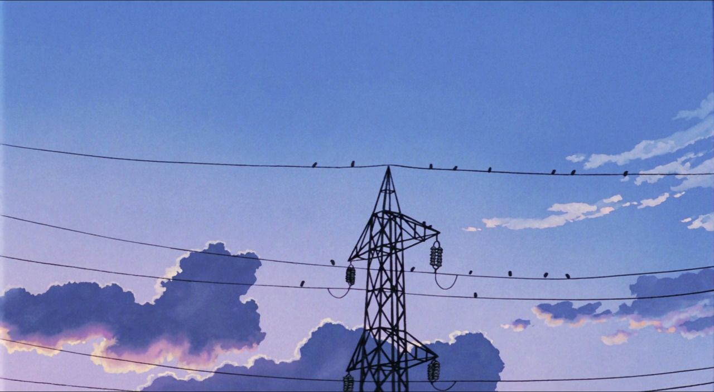
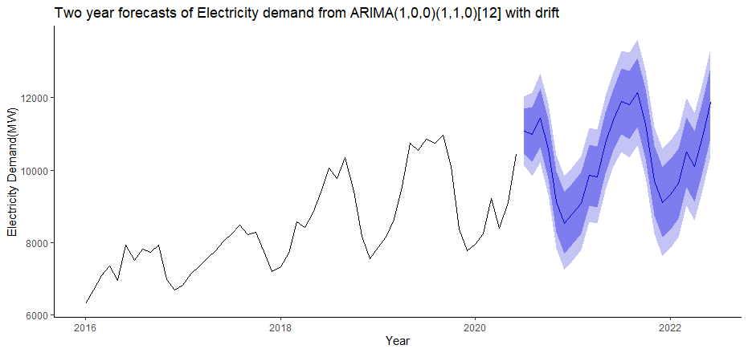

---
# Abstract

The central role of electricity in shaping the worldwide economy is broadly acknowledged in the energy
literature. Having identified the then ongoing crisis of the electricity sector, the present Awami League government
initiated restructuring the energy sector since 2009 to quicken the pace of the developmental activities. All these
efforts resulted in landmark achievements in the Bangladesh energy sector, especially in increasing the electricity
generation capacity. However, the global Covid-19 pandemic and its aftermath effects on the Bangladesh economy
require a policy revision in Bangladesh's energy sector and electricity generation mix. To our knowledge, there is no
study to analyse the adverse consequences of the Covid-19 in Bangladesh energy sector. By employing a SARIMA
forecasting model, we reveal that electricity demand will remain less than the actual generation in the upcoming two
years. Also, the DGE model finds that due to Covid-19, the economic growth rate will be around 4.5 percent in the
long-run. We further simulate that the steady-state electricity demand and standard consumption values would fall by
8-10 percent and 6 percent, respectively. We recommend that a review of the power sector master plan is needed for
future energy security and economic stability in Bangladesh.

---

## IMPACT OF COVID-19 IN BANGLADESH ENERGY SECTOR
To observe the Covid-19 pandemic effect on
Bangladesh's energy sector, the seasonal electricity
demand from 2016 to 2020 is shown in Figure 7. The
figure depicts the seasonality features and increasing
trend in electricity demand since 2016. However, the
To observe the Covid-19 pandemic effect on
Bangladesh's energy sector, the seasonal electricity
demand from 2016 to 2020 is shown in Figure. The
figure depicts the seasonality features and increasing
trend in electricity demand since 2016. 

However, the situation is different in the case of 2020. The electricity
demand in March 2020 is found to be higher than in
2019. However, it has started declining sharply from
April 2020, and till June 2020 (at the time of writing this
paper), it is still lower than the 2019 level. This is due to
the fact that Bangladesh declared a nationwide general
holiday on March 24. However, electricity demand is
catching up at a high rate because of the relaxation of
general holiday measures in the subsequent period, and
in June 2020, it is just below the 2019 level.

In this paper, we have used SARIMA (1, 0, 0) (0,
1, 0) [12] model 2 to generate a counterfactual value of
electricity demand for Bangladesh during the lockdown
period, using pre-general holiday (January 2016 to
March 2020) electricity data. The SARIMA (1, 0, 0) (0,
1, 0) [12] model is revealed as the best model in the
auto.arima function of R. Instead of traditional BoxJenkins methodology, auto.arima is a function of
forecast package, which uses corrected Akaike
Information Criteria (AIC) to select the order of ARIMA
models and it uses an algorithm, created by Hyndman
and Khandakar [38]. It runs a series of different ARIMA
models and chooses the best fitted ARIMA model by
corrected AIC.

