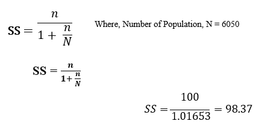

# Abstract

This paper mainly investigates people's willingness to pay (WTP) to investigate, how much
people value their lives. In other word, we tried to estimate the value of a statistical life (VSL).
The survey was based on primary data where the VSL was calculated based on the result from
determinants like household income, monthly income, and average time exposure to traffic,
gender, number of people observing accident. This paper also showed that what happen to
people's WTP when risk level reduces from 50% to 75% and whether they are willing to pay
more or not. But results depict that, people's WTP does not commensurate with the level of risk
changes. On the other hand, by using ANOVA t-test we find that WTP had no increasing or
decreasing relationship with household income, monthly expenditure and monthly income.
Because as income increases people's use of private transport increase than that of public.

## Keywords

Willingness to pay (WTP), Value of Statistical life (VSL), Mortality risk
reduction, Road accident, Stated preference method.

---

## 1.1 Introduction

There has been a popular slogan regarding road accident which says "Stop accidents before they
stop you". But as in recent times the way the number of road accidents is increasing in
Bangladesh is just the opposite scenario of our expectation. Accidents that are occurring
nowadays are mostly bus accidents and one of the main causes behind this is the careless driving.
Every person's life is invaluable. We can never measure it by putting a price to it, but we can
estimate statistically how much value people put into their lives. In other words we can measure
how much people are willing to pay for saving their lives. The willingness to pay method is also
known as contingent valuation approach. This is the main idea behind the topic "Value of a
statistical life" or "VSL" which is the main subject of concentration in our project paper.

The trade-off aspect is related in every sphere of our life. For example, cutting down of trees
would create the problem of global warming but will provide habitation for the increasing
population. But the problem of global warming is a much riskier issue for all. So, if both the
problems are weighed, that is the problem of global warming and habitation problem, then more
prominent and riskier issue of the two would be given importance. Since the societies encounter
with many risks (traffic, environment, health, etc) the regulating bodies must intervene to reduce
these risks in such way that the utility from reducing those risks must be greater or reimburse the
dis-utility from the cost of reduction of those risks. To make this clearer suppose, due to
afforestation program if the living places for increased population decreases than that would
cause a dis-utility to this amplifying amount of population. But on the contrary, this afforestation
programme would not only save this increasing population or the people of that country from
deadly effects of climate change but will also rescue the whole world from being victim to global
warming. So here the utility gained due to the plantation of trees are much greater than providing
residence to the extra population.

Similarly, in this project topic aims to show that if paying extra money could save people's lives
then the dis-utility from incurring this extra cost would outweigh the utility gained from saving a
person's life. The purpose of this study is to gain a clear understanding of what is the value of a statistical person's life, which can be estimated by individual's willingness to pay(WTP). The
cost of road accident incurs a huge loss which hampers the economic growth of our country but
always remained unobserved. That's why we have chosen to do a research on such type of topic
which can help us to prevent this daily occurrence of traffic accidents. By reducing road
accidents we will be able to save a large portion of our valuable human capital and enhance our
economic growth by preventing the economic losses caused by this problem.

This project paper has been arranged into six sections. The first section includes establishing the
concept of VSL and how it has been derived, the WTP estimation method and the background of
our study. The second section includes a brief description of the statistical data of the road
condition of Bangladesh and the justification of our study. The third section includes a literature
of the area of our study in perspective of regional and global context. The fourth section
describes our questionnaire design, data collection, and calculation of accident cost
methodology. The fifth section presents the limitations and results of our study that we have
conducted through a survey and lastly the sixth section conclude this study.

---

## 1.2 VSL

The expression value of life is a reduced form of "the value of a statistical life (VSL) . VSL
defines the monetary cost of risk reduction that could prevent one statistical death of a
homogeneous population and therefore should not be interpreted as how much individuals are
willing to pay to save a particular life.

For finding VSL different methods are used and among them the contingent valuation approach
is most used method. This approach is a way of estimating the value that a person places on a
good. It asks people to state their willingness to pay (WTP) for any risk reduction or for
preserving anything beneficial for environment. This WTP approach was first introduced by Dr`eze (1962). The theoretic substance of the concept was further developed within the expected
utility framework by Mishan (1971) and Jones-Lee (1974).

A key contributor to the literature on VSL is Viscusi. For understanding the concept of VSL
more rigorously it may be useful to take an example. Suppose that in a city composed of 20000
identical individuals, the government takes an initiative for ensuring safer bus rides for this there
is an investment project. It is known that on average 4 individuals die every year on the selected
road and the project is expected to reduce mortality from 4 to 2 anticipated mortalities per year.
Suppose now the willingness to pay is 100Tk annually which is paid by each member of the city
who will be benefited from this reduction in mortality risk induced by the project. Then the
corresponding VSL would be ((Tk100)/(2/20000) =10 lakh. So, hypothetically people of that city
are willing to pay 20 lakh for saving 2 random lives and it could be collected to save 2 statistical
lives. This example also illustrates why estimations about individual's VSL can be useful. As,
regulators now have an array of interventions on which they can do cost-benefit analysis and find
the best possible solution to maximize utility. It isassumed that if one person is not willing to pay
or ignores the payment of city members from this specific project but another person from that
same city has some information about money or risk tradeoffs choices concerning other mortality
risks, then it can be useful to compute an average of VSL in this city(Viscusi, 1993; Viscusi and
Aldy, 2003).

---

### 1.2.1 Theoretical insights into VSL

We consider a typical single-period VSL model. Here, the individual maximizes his expected
indirect utility which is given by,

Where,
p = probability of surviving the period,
u(w) = utility of wealth w if he survives the period, and
v(w) = utility of wealth w if he dies (typically, the utility of an inheritance). This model was
introduced by Dr`eze (1962) and Jones-Lee (1974) and has been commonly used in the VSL
literature.

We assume the standard assumptions that v and u are twice differentiable with

This assumption shows us that state-dependent utilities are weakly concave and are increasing. It
furthermore depicts that at any wealth level, if a person is alive then his/her utility and marginal
utility both is larger than a dead person. According to this standard assumption, indifference
curves over (w, p) are decreasing and strictly convex.

- Let us assume that the members of a particular population are willing to pay an average
of ten Taka each to reduce a given risk level from 3/20000 to 2/20000. If everyone in that
population contributes ten Taka, then, on average, one life will be saved per group of
20000 people at a cost of Tk 200 000 to each such group.

- Normally in VSL it doesn't measure only individual's willingness to pay to avoid death
with certainty, or what an individual is willing to accept to face a death with certainty.
VSL measures the willingness to pay for a little change in risk. It can be measured by
calculating the additional amount a person desired to pay when risk changes in infinitely
small portion6. In other words, the VSL is the marginal rate of substitution (MRS)
between wealth and survival probability, that is, (the negative of) the slope of the
indifference curve at (w, p). It is defined as follows:

Given our assumptions, this value is positive and depends on the individual's utility function but
also on existing wealth and risk levels. A graphical interpretation of this value is given in Figure
1.

After knowing this theoretical framework it would be interesting to see how this VSL works for
both wealth and mortality risk. Naturally, we would expect it to be an increasing function of
wealth (since willingness to pay clearly is) and also an increasing function of mortality risk. In
fact, an individual opposing a very high underlying mortality risk might also demonstrate a very
high willingness to pay, because certain weight might attach to any increasing and decreasing
risk.

As we saw above, the value of statistical life can be calculated from an individual willingness to
pay. In practical terms, if individuals are willing to pay Tk90 for a 1/1000 reduction in the
underlying risk of death, the value of human life works out to Tk 90000.

However, we need to start by evaluating individual willingness to pay.

---

### 1.2.2 Willingness to pay estimation

For creating a feasible plan the policymakers need to rank the policies based on the effectiveness
and also can use the cost and benefit analysis. Cost and benefit analysis approach includes a
common metric which is the "monetary value". Monetary values help to understand rigorously
the value of both marketed and the nonmarketed goods and likewise this comparison makes the
prioritization process more transparent. But there are many construction processes that do not
have the market value.

The willingness to pay approach can identify the effectiveness or the value of non-marketed
goods. For example instead of decreasing the road traffic, road improvements might increase
road traffic because in the construction process of the road, many vehicles are used like
Bulldozer, backhoe, dump truck which increases emission and noise levels. In addition when a
new road is constructed refreshment areas may be lost, the wildlife may be badly affected.
Subsequently if this negative effect is valued at market price then the expected benefits may be
less than the cost. So, by observing the negative side of the construction process a society
member does not want road construction and his WTP in this case is zero. But instead of the
construction process if the government takes a policy for improving the wrecked vehicles, raise the awareness among the drivers then it could be more convenient and in this case the society
member's WTP is more than zero. So with help of willingness to pay it's easy to rank the
priority for a project.

---

## 1.3 Background

In both developed and developing countries traffic accidents have become a major problem,
while related to different historical causes and conditions. Because of the frequent use of
automobile road accident has become a common feature. In the industrialized countries the uses
of automobiles have reached a high level and side by side traffic accident problem started to
become serious in the first decades of the century in the US. The difficulties regarding road
accidents have become serious also in most of the European countries and also in Japan after
World War II. In developing nations, the traffic accident problem has been rising since at least
the 1970s, when most of the countries became dependent on motorized transportation in general
and on automobile transportation in particular. It is reaching in a pestilence proportion.

For road accident incident an enormous portion of people died every year. According to the
statistics each year more than 1.25 million people die for this traffic accident problem (Lydia &
Richard, 2018). A road accident not only takes lives but also the people who get injured, suffer a
lot. The victim of a road accident can also suffer from non-fatal injuries, and around 20 to 50
million people or more than that suffer in nonfatal injuries. Road accident can also bring a
difference in economy. For the phenomenon economic losses can be faced to the individuals,
their families and to the nations as well. The cost of traffic crashes is like a systematic chain.
People injured in traffic accident lost their productivity and become a burden for their family
because many of them become unemployed, disabled for their injury and also if the victim is
only earnable in the family, then the whole family may go under the poverty line. This cost for
traffic crashes is not bounded within the family, the country also takes into account the cost
socially and economically. In most of the countries road traffic crashes cost 3% of their gross
domestic product and 90% of the world's fatalities on the roads in low and middle-income
countries, however these countries have approximately 54% of the world's vehicles
(WHO,2018).

From a public health viewpoint, traffic mortalities have become gradually more significant
among overall fatalities and are affecting mainly the most vulnerable users. Actual facts,
information and figures are certainly higher than the reported one, due to lack of proper
information. The fail in relating reported deaths to traffic causes and the fail in registering post accident deaths, the number of injuries is mostly unknown, that is why the mentioned problems
become even more severe.

Bangladesh is a small south Asian country. Bangladesh covers an area of 147,570 square
kilometers and it shares borders with India and Myanmar. The current population of Bangladesh
is 166,901,111 (UN, 2018) and it considers as world's most densely populated country. The
population density in Bangladesh is 1278 per square km. Bangladesh is the fastest growing the
South Asian country, the Gross Domestic Product of Bangladesh was $221.415 billion and Gross
National Income per capita was $1330 (World Bank, 2017).Total land area of the country is
130,170 square Kilometer. Road transportation is the main mode of long-distance travel. About
70% of the country's total passenger and cargo volume is mechanized by road transport. And
effectively covered by the railways is about 32% of the total area of Bangladesh. Road condition
of Bangladesh is very poor as the concept of road safety is very less known in Bangladesh.
Violation of traffic rules, unskilled drivers and vehicles without fitness are the daily norms now.
Analyzing the accident victims statistics, about 45% are pedestrian, 19% are light vehicles
passenger and 13% three-wheeler and the types of accidents are like 42% hit-and-run, head on
collisions 19% and 13% due to overturned vehicles (M S Siddique, 2018).

In Bangladesh, like other low-income and developing countries, road accidents are one of the
major causes of death. The number of vehicles on the roads are increasing dramatically after the
country has started progressing economically. Besides reduction in poverty and lack of proper
control management are also responsible for this occurrence.

From figure-2, we can understand that the number of the vehicles in Bangladesh are increasing
exponentially.Consequently, traffic accidents resulting in injuries and death rate have
significantly increased, as shown in Fig. 3. In 2013,there were 2365 traffic accidents, which
increased to 3214 by 2017. In addition, the number of fatalities and injuries was also higher and
rising from 1957 and 2765 in 2013 to 2017 (Bangladesh government website portal:2018).

Consequently, road safety has become a major concern in Bangladesh, with experts from the
Asian Development Bank estimating that fatalities could more than double over the next 5 to 10
years unless immediate action is taken.This indicates a crucial need to act upon road safety
progress (ADB, 2017).

Road accidents have severe consequences which include deaths, injuries, disabilities, material
damages, pain, grief and suffering (Komba, 2006; Partheeban et al., 2008; Haddak et al., 2016).
Therefore,traffic accidents have substantial adverse economic and social impacts on the accident
victims, their family, friends, as well as on the nation as a whole (Gopalakrishnan, 2012;
Niroomand and Jenkins,2016). Further, the increasing number of traffic accidents results in an
increasing economic burden on the country as well as on the victim's relatives (ADB, 2005;
Haddak et al., 2016).

Considering the above conditions there are some other problems which also hampers the road
safety issues. Bangladesh import vehicles from the second-hand market of Japan. Bangladesh
road is suitable for left-hand drive vehicles but imported vehicles are right-hand drive vehicles.
As the driver can't see the traffic coming from the opposite side while overtaking it created more
crashes. 2.62% of total death is from a road accident (WHO, 2017).The growth of motorcycle
use is high but still the most significant sector is public transport sector or public bus. A major
contributor in the road accident is heavy vehicles like bus and truck and it involved with about
58% of the total accident. Causes of road accidents ranging from population explosion,
unplanned urbanization and tremendous growth of all kind of non-motorized and motorized
vehicles. Another reason is also improper traffic management. To reduce the GDP loss every
year from the traffic accidents the government need to be more focused and invest more in the
transportation sector.

---

## Justification of our study

Road safety actions are hard to justify without knowing the monetary benefits of road safety
improvements (Bhattacharya,2007). Therefore, as it is widely recognized that accident costs need
to be estimated to observe the scale of the existing problem, it is imperative to evaluate traffic
accident costs for developing appropriate road safety policies (Jacobs, 1995; de Blaeij et al.,
2003; Silcock, 2003). Compared with other developing countries, in Bangladesh, there has been
little road safety research concerning the true costs of road accidents. This has been mainly
because of the lack of reliable data to assist decision makers in taking relevant actions.
Therefore, determining the true costs of traffic accidents in Bangladesh is essential: (1) to
determine the overall economic losses associated with road accidents (2) to observe the scale of
the problem and the benefits derived from prevention policies and (3) to examine the
determinants for the willingness to pay (WTP) in order to support regulators to develop better
road safety policies. For this reason we have chosen to do research on this topic

---

# Literature Review

WTP can be find out in two major ways. They are 1.) Stated preference method and 2.) Revealed
preference method. Revealed preference can be used to analyze the people's actual behavior and
choices (Bateman et al., 2002; Svensson and Vredin Johansson, 2010). It is also used only for the
goods that are available in the market (Vloerberghet al., 2007). On the other hand, the stated
preference method known as the contingent valuation is used to know the people's willingness to
pay(WTP) in order to improve their own safety or some other people's safety for any
hypothetical condition. The individuals that are surveyed are the representative sample of a
population.

There are various methodologies of Accident costing. Jacobs (1995) and Silcock (2003) has
mentioned the WTP approach, Human capital approach, life insurance approach, the net output
approach. Out of all these the human capital approach and WTP is the most used and common
approach. WTP mainly focuses how much an individual is willing to pay for the reduction of any
fatality or injury on the basis of their own preferences (Rizzi and Ortuzar, 2006) whereas the
Human capital (HC) approach mainly shows the discounted value of the loss of output from the
injured party but does not reflect on the loss of quality of life (Chaturabong et al., 2011; Ainy et
al., 2015; Haddak et al., 2016).

The losses from a road accident are beyond the scope of market value. Although the value of
losses is not reflected in the official national product statistic the humanitarian costs are the
consequences of the injuries lead by indirect loss of resources and the psychological impact of
road accident also significant. (Jiri Alinal, 2013). 

The value of statistical life that is the mean marginal rate of substitution of own wealth and
safety and it us used as a benefit measure for the safety of the population. Benefit measure is
based on self-interest preferences of individual and people do not act only depending on self interest but also on the context of social interaction (Becker, 1976; Sen, 1987). It seems
reasonable if individual is not purely self-interested and concern about others safety and it has
been argued, that the altruistic component should reflect the value of road safety (Mishan et al.,
1971; Jones-Lee et al., 1976; Needleman et al., 1976).

Calculating the economic value of human life and theequivalent value of damage injury,
economic assessment can be done. An approach that takes into account; life year gained,
avoided premature deaths, in health economics and environment, Chanel and Vergnaud, (2004).

Economists said that when the fatality risk among the population is alike and small then only the
VSL idea would be applicable. So, this statistical lives issue now comes up with a question that
how a project would be estimated that may save or threat the lives of the known people. It also
meets a well-known theoretical issue, "Broome's paradox". If a project may kill one person from
a population of similar individuals and the identity of the victim was unknown, the project may
be approved. Nevertheless, if a victim's identity is known than that project would not be
successful just because the potential victim might have to be compensated with a vast amount.

Arthur (1981) showed that the societal willingness to pay is equal to the average willingness to
pay for the mortality risk reduction and also the gains from increased utility due to the safety of
himself/herself or others. Bergstorm (1982) showed that if other people are willing to pay an
additional sum of money to reduce the mortality risk in a road accident that should not be
considered as how much the society is willing to spend for reducing the reduction.

Carlsson et al. (2004) examine the respondent's willingness to pay for two transport modes
traveling by air or taxi. For the same starting point and reduction in risk, they find that
willingness to pay is significantly higher when traveling by air compared with by taxi. One
explanation for their result is that respondents perceived traveling by air to be riskier, even
though the risks were the same size in the survey. This could be related to how travelers perceive
the controllability, voluntariness and responsibility of a risk of a specific mode. If travelers
perceive risks in surface transport to be less terrible than other transport modes (air,
underground, etc.), we expect a willingness to pay to be greater for the latter which was the
finding in Carlsson et al. (2004).

Hammitt and Treich (2007) has inspected the Broome's paradox. They said that if the affected
person is compensated with money then that would be a good substitute for the well-being of the
people only if the marginal utilities are same among the individuals. That's why they explained
this paradox is related with the distributional effect. Beside this Hammitt and Treich studied the
effect of information about the heterogeneity of risk in the population, that is the effect of individual identify ability on the average Willingness to pay or for a mortality risk change. They
show that "The average willingness to pay is typically larger with more information about how
the project affects person risks". Hence it has been seen that there is more probability of a project
of being accepted if it is without information rather than if individuals, specific information is
provided. If more information is provided then there is more probability of rejecting a risk
increasing project. On the other hand it has also been shown that peoples average willingness to
pay decreases if additional information are provided about the heterogeneity of risk change.
Hammitt and Treich (2007) thus concluded that there is no relationship between the amount of
risk change and the safety level as shown by economic analysis.

Chaturabong et al. (2011) used the WTP-CV for estimating the value of statistical life (VSL) and
value of the statistical injury (VSI) for the motorcycle users in Thailand. It was a questionnaire
based conducted in Bangkok and its adjacent areas on the people of various professions. The
survey was conducted at different locations like school, colleges, universities, government
offices, and private companies. The respondents included 1015 motorcyclists who were
randomly selected. Using the simple arithmetic mean the mean WTP was calculated and also the
factors that are influencing the WTP were calculated using the regression analysis. It was seen
that the VSL ranged from 0.17 million USD to 0.21 million USD, and the VSI ranged from 0.08 million USD
to 0.10 million USD. The concluding part was that the people who wore a helmet during their
motorcycle ride and the government officers were willing to pay more than those people who
have lower income, aged people and male motorcycle riders.

Bhattacharya et al. (2007) estimated the VSL for the daily passengers in Delhi using the WTPCV approach. The survey was conducted in the year 2005 and the respondents included
roadtravelers like pedestrians, bicyclists and motorcyclists. The total number of people
interviewed was 1200. Each of them had at least 8th-grade education and were mostly aged
between 18-65. Probit regression analysis was to determine the factors influencing WTP. The
estimated VSL was $0.15 million. It was shown that the household size has a negative impact on
WTP while the exposure to traffic education and income positively influences the WTP.

Yusof et al. (2013) estimated the cost of the road accident fatality in Malaysia using the WTP
with the conjoint analysis approach. The respondents were interviewed from the 13 states of
Malaysia which included car drivers and motorcyclists. In total there were 4000 participants.

Linear regression analysis was used to determine the factors influencing WTP. The factors that
positively influenced WTP was found out to be race, vehicle ownership, risk perception, income,
gender, occupation, and accident experience. The estimated VSL ranged from $0.36 million to
$0.45 million by means of the CA.

The study of VSL of developing countries are scarcer than developed country and the
government of developing country does not have typically official VSLs. Developing countries
attempt to approximate VSLs that consist of regression estimates based on the developed
country. (Bowland & Beghin, 2001; Miller, 2000). VSLs of developing countries tend to lower
than the developed country as human life is less worth in the poor countries. GDP per capita is
found to be an important independent variable (Bowland & Beghin, 2001; De Blaeij et al., 2003;
Miller, 2000) with elasticities in the range of 0.50 (Blaeij et al., 2003) to 0.85 and even 1
(Miller,2000)

Many research conducted in several developing countries on VSL regarding several issues.
Analyzing cost-benefit of India regarding health and safety regulations value of statistical life is
0.64 million USD and value of statistical injury is 0.02 million. These values estimated using the
hedonic wage approach and observing the labor market. (Majumder, Agamoni & Madheswaran,
S. 2018. In Pakistan VSL to be between 122,047 USD and 435,294 USD per statistical life the values are
evaluated using compensated wage models or contingent valuation method. (Rafiq, M., Shah, M.
K., 2010). VSL conducted in Bangladesh revealed that the value decreases strongly with age and
fewer preferences for lives per se rather than saving more live years. The data collected using the
survey method. (Mahmud, M. 2005).

Reviewing literature, the WTP questionnaire method was found suitable for the respondent of
Bangladeshi students. Since all of them are educated therefore they could easily understand the
theme of risk reduction. Due to less concern about road safety no such research has been
previously conducted.

Though a lot of work has been done relating to this topic in other developed and developing
countries no such initiative has been taken in Bangladesh regarding estimating the VSL of the
people for road accident fatality risk reduction. Though a paper was published named
"Measuring trust and the value of statistical lives: Evidence from Bangladesh" (Mahmud, M. 2005), but the objective and methodology of that paper were quite different from this one. The
main objective of that paper was not to find an absolute value of VSL rather substantial risk
changes were used to be valued and determine the effect of training concerning the risks and
probability on the WTP responses. There the respondents were trained first before conducting the
survey. After that the respondents were told to report their perception of the risk of dying based
on their health condition and the information that was provided in the survey regarding the age related risks of dying. So it was more of health-related issue. At the present time the rate of road
accident fatality in our country has been increased at such a towering rate that it has become a
really important issue to work with. So, since no work or research has been done before
regarding the VSL of road accident fatality risk reduction in Bangladesh that's why we chose to
do research regarding this topic to find out what is the value of people lives and how much they
really value it and also what is their willingness to pay for reducing this risk.

# 4 Questionnaire Design

The respondents of this study were given a set of hypothetical questions which they were asked
to value on their own perspective. An experimental willingness to pay (WTP) question was
added along with the other questions as an example of an easy risk reduction valuation. Our main
motive for including the WTP question was to see what is the maximum amount of money the
respondents are willing to spend when road accident mortality risk reduces to 50%. And when
the mortality risk reduces to 75% whether they are also willing to pay more than before.

The questionnaire comprised of 5 sections. They are: (1) socioeconomic characteristics (2)Daily
travelling behavior and cost (3) Exposure to traffic (4) previous accident experience of friends
family or themselves and (5) a WTP valuation question in order to reduce the individual road
accident mortality risk and (6) Personal perception on the traffic condition of Bangladesh.. The
questionnaires that were provided to the students are given in details in the appendix section. A
brief description of the 5 sections mentioned above is discussed below.

- Socioeconomic characteristics:

This section includes the general information about the respondents like age, sex, full-time
occupation, monthly income and expenditure, household income, number of family
members,vehicle ownership and license. Since we have conducted the survey on BUP students
of different departments their department name, Batch, and class ID was also included in the
questionnaires.

- Daily traveling behavior and cost:

The traveling behavior of the respondents were assessed by the information's like number of
their daily bus rides, most used transport every week, ever got into a running bus, if anyone puts
their head or hand outside the window during riding, whether anyone instigate the bus driver to
drive fast and what is their estimated total cost of daily traveling.

- Exposure to traffic:

This included how many hours on an average a particular individual stays on road.

- Previous accident experience:

Information about any previous accident encountered by the respondent himself/herself or any
close relatives like family or friends has been collected.

- Personal perception of the traffic condition of Bangladesh:

This study dealt with the insight thought of Bangladeshi people about the current condition of the
traffic system. Also we asked a question about the riskiness of their behavior so that we can
evaluate if there is any relationship between WTP with risk increasing/reducing behavior.

- WTP valuation questionnaire:

The most important question in our survey was this WTP approach. This reflected the monetary
valuation of an individual to avoid the road accident fatality. Different respondent has expressed
their different values of willing to pay(WTP).

We had three parts of the WTP valuation questionnaire. The first part described a hypothetical
situation where there are two types of bus driver namely Driver-A and Driver -B. The type "A"
drivers are educated(HSC passed). They have the proper sense of knowledge about traffic rules
and obey accordingly. The drivers had proper training and counseling before getting their driving
license. On the other hand, the type "B" drivers are less educated (class 5 passed). They have the
minimum knowledge about traffic rules and doesn't maintain the rules while driving. The drivers
even didn't have any training or counseling on bus driving. So if the buses are driven by type
"A" drivers i.e. educated and trained drivers the road accidents can be reduced significantly.

So, the first question was if the respondents are willing to pay any extra amount of money for
getting the service of type "A" drivers. If they answer in affirmative, then the next situation
described was that if all the bus drivers are of type "A" then 2 deaths occur per 20,000 people
and if all the bus driver are type "B" then 4 deaths occur per 20,000 people. Which means that 2
lives would be saved per 20,000 people if the buses are driven by type "A" drivers.Or in other
words we can say that accidental deaths are reducing to 50%. Therefore the question was what is
the maximum amount they are willing to pay to reduce accidents in this case.

And then the last question was that if all the bus drivers are of type "A" then 1 death occur per
20,000 people and if all the bus driver are type "B" then 4 deaths occur per 20,000 people.
Which means that 3 lives would be saved per 20,000 people if the buses are driven by type "A"
drivers. Or in other words we can say that accidental deaths are reducing to 75%.Since the death
rate is decreasing than before then of course they must be willing to pay more than before. And
those with zero willingness to pay (WTP) were not required to answer the last two questions as
they were not willing to pay any money for taking the service of type A drivers.

This is what we will evaluate how much people are willing to pay more to save the life or much
they are valuing their lives. We are only concentrating our survey on only one mode of the
vehicle that is a bus.

---

## 4.1 Data Collection

- (a)Sample size determination:

The statistical equation for defining sample size

Where, SS, the desired sample size

S = sample size for infinite population

z = the standard normal deviate set at 1.64, which corresponds to the 95 percent confidence level
(at P < 0.05).

p = the proportion in the target population estimated to the prevalence rate of violence and
discrimination incidence (Set at 96%).

q = 1.0 - 0.80 = 0.20

d = Degree of accuracy desired, set at 0.04

For adjustment of the sample population, we can apply:

Assumed 5% non-respondent = 98.37 

- (b)Data Collection Method

Primary Data: Primary data was collected from surveying the target population with the
appropriate questionnaire for the required information to address the stated objectives.

Secondary Data: Different websites are mainly used to collect relevant secondary data for this
particular study. Different articles of many renowned scholars were also used as a source of the
secondary data source.

- (c)The procedure of data collection
The survey was done on the students of BUP from different departments. The departments
included BBA, AIS, Economics, Sociology, Law, International relation(IR), Management,
DHSM, Public Administration(PA), Mass Communication and Journalism(MCJ), English, and
Development Studies(DS). Students were selected randomly from different batches. So, it was a
typical case sampling which is a form of purpose sampling method. As sampling proportionality
is not the main concern for our study purpose sampling would give a quite good picture of the
population. The questionnaires in paper form were provided to the students by ourselves
individually going to the respective department and batches. The students were given a brief about our survey and the importance of it. We described them about the recent scenario of
increased mortality rate due to road accidents. So, it is high time to take an initiative to prevent
this. Therefore, how much they are willing to pay in such a burning issue is really important as
most of the students travel daily by bus. Besides we have also explained the importance of road
safety, the impact of road accident and the increasing road accident fatality rate in Bangladesh.

If any of the students faced any problem, while answering the questions they were properly
guided and given knowledge about the problem they were facing. After collecting all the
answers, the data were arranged in an excel sheet. In total we had 130 samples. This study
targeted the respondents who were mainly exposed to traffic. And as the students had to daily
travel outside for different purposes so we thought to choose them as a good respondent. The
question form included, questions regarding their traveling behavior, estimated the cost of
traveling, the WTP question, some socioeconomic question and others which are already
mentioned above.

The questionnaire was translated in English for the respondents and was conducted in August
2018 to investigate the respondent's understanding of the questionnaire. The questionnaires were
then edited as per the respondent's comments. Data were collected from October 2018 from the
above departments.

In this paper the respondents were selected using the sampling technique. Respondents over 18
years and who had at least passed higher secondary certificate (HSC) grade were interviewed in
order to understand risk information and the WTP question. Before giving the questionnaire to
the respondents, the reasons for the questionnaire and the research purposes were explained to
the respondents. Additionally, the importance of road safety, the impact of traffic accidents, and
the road accident fatality rate in Bangladesh were explained. Then, the respondents were asked
about their socioeconomic characteristics, travel and driving behaviors, experience and risk
perception, and the WTP value for a 50% fatality risk reduction and 75% fatality risk reduction.

---

## 4.2 Accident Cost Methodology

The price of an individual's life is undoubtedly immeasurable but then also through the VSL
concept the cost of an accident can be known (Persson et al.,2001), which is defined as the total
amount of money an individual is and what is the value of an individual's life can also be find
out. VSL can find out by dividing the mean or median of WTP with a change in risk ()
(MohdFauzi et al., 2004; Andersson, 2007; Svensson and Vredin Johansson 2010; Yusof et al.,
2013). The formula of it is as follows:

---

# 5 Results and Discussions

- Descriptive statistics of the respondents:

There were 130 respondents in total out of which 7 were bike riders, 53 were bus passengers, 6
were CNG users, 52 persons were rickshaw users and the rest 11 were either Uber or personal
car riders. A bar diagram has also been shown pointing out the above statistics. So in our survey
the first most transport users were the bus riders and the second was rickshaw.

In the questionnaire there was a question relating to how many people have the license
ownership of any vehicle. The results showed that 14 people had a car license, 5 had both car and
motorcycle license, 8 people only motorcycle and the rest didn't own any of the vehicle's license.
The statistics are being shown below in Table 1.

Similarly the respondents who had vehicle ownership were also conducted. And the results are
shown below in Table 2. It shows that 103 people had vehicle ownership and 26 didn't have any.

And another statistic that has been found out from the survey is how many people get into a
running bus. The table below shows that 91 people have got into a running bus whereas 38 have
not done so.

---

## 5.1 Mean and median WTP values for 50% and 75% fatality risk reduction:

The mean WTP value for 50% fatality risk reduction is 7249.2tk or 86.55US$ and the median
WTP value is 3000tk. Again, the mean WTP value for 75% fatality risk reduction is 9758.9Tk or
116.51 US$ and the median WTP value is 3800tk. Some of the respondents had zero WTP. The
table below shows that 55.50% rickshaw riders have zero willingness to pay which is the highest.
And the next one in the rank is the bus riders with a percentage of 22.20%. A table is included
below showing the results in brief.

Those who gave zero WTP many of them added their reason behind giving this answer. Some
said that it is the responsibility of the government and the respective person to employ trained
drivers and to pay them the proper amount of money that the educated drivers deserve. And
some added that as they don't use bus as their transport regularly, so they are not concerned
about this matter. In this case study the most possible reason for the rickshaw riders to have zero
WTP is as most of the time the rickshaws don't travel in the busy roads so they have less risk of
accident. That's why they have highest zero WTP.

Here the WTP on the basis of Monthly income has been shown. Those with above 20 thousand
taka monthly income has the highest WTP for both 50% and 75% fatality risk reduction.

---

## 5.2 VSL and accident cost:

3000 road accidents take place on an average in Bangladesh annually killing about 2700 and
injuring 2400. And the estimated economic loss from such accidents are 40,000 which is about
2%-3% of Bangladesh's GDP. In 2017, 7,397 people lost their lives and 16,193 were injured
(Nawaz Farhin, 2018).
In this survey, the value of the VSL for mean is 7.24 crore taka or 0.86 million US$
approximately and VSL for median is 3 crore Taka or 0.35 million US$ for 50% fatality risk
reduction. And for 75% fatality risk reduction VSL for the mean is 6.50 crore Taka or 0.77
million US$ approximately and the Median value is 2.53crore taka or 0.30 million US$.12 We
have derived this result by applying the above formula of VSL given in equation 1. We have also
estimated the VSL for some of the determinants of WTP. At first on the basis of observing
accident we see in the below table that the average WTP for those who have not observed the
accident in case of 50% fatality risk reduction is 6979.285714 thousand taka and for 75% fatality
risk reduction is 10007.14286 thousand taka. And the VSL for 50% and 75% risk reduction is
69792857crore and 66714285.71 crore taka respectively. Again those who have observed the
accident, the average WTP in case of 50% fatality risk reduction is 7654.237288 thousand taka
and for 75% fatality risk reduction is9464.576271 thousand taka. And the VSL for 50% and
75% risk reduction are 76542373 crore and 51028248.59 crore taka respectively.

A bar diagram has also been shown below which shows that the average WTP and VSL for an
individual who have observed the accident in case of 50% risk reduction is greater.

After that the VSL is estimated on the basis of household income.

Here the VSL is the highest for the people who are within the income group of below 50k. The
next rank is for the people within the income range of 1.5lakhs-3lakhs. And the lowest VSL is
for above 3 lakhs income group people. We conducted an ANOVA test which also showed that
there is negative relationship of household income, monthly expenditure, and monthly income
with the WTP because as mentioned earlier that if people's income increases then they will use
more of private transports like car, UBER or CNG rather than bus.

VSL on the basis of gender has been shown in the table which illustrates that the average WTP
and VSL for 50% fatality risk reduction is greater for male than the female. But in the case of
75% risk reduction the average WTP increases and for a male is higher but the VSL value
decreases in comparison to the value of 50% risk reduction.

A bar diagram has been included where the red bar indicates the VSL for 75% fatality risk
reduction and a blue bar for 50% fatality risk reduction.

Now the VSL and WTP for the most used transport have been depicted. Here it shows that the
bike riders have the highest WTP for both 50% and 75% mortality risk reduction and the VSL is
also highest among all other transport users. Prof Moazzem Hossain, director of Accident
Research Institute at Buet mentioned that "The rate of a motorcycle accident is greater than all other motorized vehicles".( Tribune Desk, 2018).Transport specialist Prof Shamsul Haque of the
civil engineering department at Bangladesh University of Engineering and Technology (Buet)
said motorcycles are a commuter-friendly transport but not healthy for the city's traffic system as
it is 'very risky' for both the biker and passenger( Tribune Desk, 2018). So, the result matches
with our present situation of Bangladesh where the bike riders are at a high risk of an accident. In
the above table of Zero WTP respondents also we have seen that only one bike rider had only
Zero WTP. And second highest ranked VSL is for the bus riders. This result is quite common
because with the recent increasing rate of accidents in Bangladesh especially the bus accident of
some school students had a really massive impact on the people of our country and the school
college students came to the road in protest of this.(BBC news, 2018). So that's why people have
now become more alert and so they are more willing to pay and their VSL is also the second
highest. A bar diagram of it has also been included.

Now on the basis of hours exposure to traffic the VSL and WTP have been estimated. Those who
remain more hours outside the house on average that is 5-10 hours they have more WTP and
VSL than those who remain outside below 5 hours.

---

## 5.3 Limitations

As Bangladesh is a developing country there is a large possibility that accidents and deaths are
under-reported and the study did not make an adjustment for this shortcoming. The main
limitation of this study was the warm glow effect which mainly is the individual contribution to
the public good. The recent road-safety protest, news and awareness overestimated the study
which may go down in the recent future. The representative of the study was from the urban area
and they were all educated so the limited demography might not represent the whole of
Bangladesh. It is maybe difficult for the less educated or uneducated people to understand the
willingness to pay question. Thus the VSL for the whole Bangladesh might be lower than the
VSL in this study.

---

# 6.Conclusion:

This research paper aims to know the fact that how much people are willing to pay for saving a
statistical life. In a country like Bangladesh, where road accidents have become a daily
occurrence a survey like this is of great importance. Because if such steps are taken in the future
for reducing the road accident fatality this survey result would help us to get an idea whether
such an initiative will be fruitful or not. This study mainly reflects upon the fact that if the
educated driver is employed in driving the buses than it can be expected that the road accident
can be reduced to some extent. From the above analysis it is seen that the VSL for the students of
BUP is 7.24 crore taka for 50% risk reduction and for 75% is 6.50 crore taka. Therefore its now
the responsibility of the government to take some steps immediately as soon as possible for the
greater benefit of the people and the country's economic growth as well.

---

# References

- Ainy, E., Soori, H., Ganjali, M., &Baghfalaki, T. (2015). Eliciting road traffic injuries
cost among Iranian drivers' public vehicles using willingness to pay
method. International journal of critical illness and injury science, 5(2), 108.

- Alina, J. (2013). The models of calculation of external cost from road traffic accidents
[Ebook].

- Andersson, H., & Treich, N. (2011). 17 The value of a statistical life. A handbook of
transport economics, 396.

- Arthur, W. B. (1981). The economics of risks to life. The American Economic
Review, 71(1), 54-64.sss

- Bangladesh Population (2018) - Worldometers. (2018). Retrieved
from http://www.worldometers.info/world-population/bangladesh-population/
??? Bateman, I. J., Carson, R. T., Day, B., Hanemann, M., Hanley, N., Hett, T., ...&Sugden,
R. (2002). Economic valuation with stated preference techniques: A manual. Economic
valuation with stated preference techniques: a manual.

- Bhattacharya, S., Alberini, A., & Cropper, M. L. (2006). The value of mortality risk
reductions in Delhi, India. The World Bank.

- Carlsson, F., Daruvala, D., & Jaldell, H. (2010). Value of statistical life and cause of
accident: A choice experiment. Risk Analysis: An International Journal, 30(6), 975-
986.

- Chaturabong, P., Kanitpong, K., & Jiwattanakulpaisarn, P. (2011). Analysis of Costs of
Motorcycle Accidents in Thailand by Willingness-to-Pay Method. Transportation
research record, 2239(1), 56-63.

- Dionne, G., & Lanoie, P. (2004). Public choice about the value of a statistical life for cost benefit analyses: The case of road safety. Journal of Transport Economics and Policy
(JTEP), 38(2), 247-274.

- Fauzi, M. Y. M., Ghani, M. N. N., Umar, R. S. R., & Hariza, H. A. (2004). The value of
life and accident costing. Applied health economics and health policy, 3(1), 5-8

- Haddak, M. M., Lefevre, M., &Havet, N. (2016). Willingness-to-pay for road safety
improvement. Transportation Research Part A: Policy and Practice, 87, 1-10.

- Hussain, A. (2017). Private cars carry 5% passengers, occupy 29% space. Dhaka tribune.

- Jacobs, G. (1995). Costing road accidents in developing countries. OVERSEAS ROAD
NOTE 10.

- Mahmud, M. (2005). Measuring Trust and the Value of statistical lives: evidence from
Bangladesh (No. 145).

- Majumder, A., & Madheswaran, S. (2018). Value of Statistical Life in India: A Hedonic
Wage Approach.

- Nawaz Farhin (2018, April 23). Why are road crashes rising in Dhaka?Dhaka Tribune.
Retrieved from https://www.dhakatribune.com/bangladesh/dhaka/2018/04/23/roadcrashes-rising-dhaka/

- Nunes, P. A., & Schokkaert, E. (2003). Identifying the warm glow effect in contingent
valuation. Journal of Environmental Economics and Management, 45(2), 231-245.

- Persson, U., Norinder, A., Hjalte, K., & Gralen, K. (2001). The value of a statistical life in
transport: findings from a new contingent valuation study in Sweden. Journal of Risk and
Uncertainty, 23(2), 121-134.

- Public Transport: 87pc vehicles violate rules. (2018). The daily star.

- Rafiq, M., & Shah, M. The Value of Reduced Risk of Injury and Deaths in Pakistan using
actual and perceived risk estimates [Ebook].

- Rahman, m. (2015). Identification of injury patterns of hospitalized motorcyclists and
development of countermeasures for their safety improvement. Dhaka, bangladesh

- Rahman,M.(2018). Poor road condition. Retrived
fromhttp://www.theindependentbd.com/printversion/details/139650

- Rashid, H. (1978). Geography of Bangladesh. Boulder, Colo: Westview Press.

- Rizzi, L. I., & Ortuzar, J. D. D. (2006). Estimating the willingness-to-pay for road safety
improvements. Transport reviews, 26(4), 471-485.

- Siddiqui, M. (2018). Road accident scenario in Bangladesh. Daily asian age.

- The Daily Star. (2018). Over 2,400 deaths on roads this year: Report.
- Tribune Desk ( 2018, July 17). Motorcycles doubled in Dhaka in 8 years .Dhaka Tribune.
Retrieved from https://www.dhakatribune.com/bangladesh/dhaka/2018/07/17/number-ofmotorcycles-doubled-in-dhaka-in-8-years

- Vloerbergh, I., Fife-Schaw, C., Kelay, T., Chenoweth, J., Morrison, G., Lundehn, C.,
2007. Assessing Custormer Preferences for Drinking Water Services-Methods for Water
Utilities. TECHNEAU

- Yusof, M. F. M., Nor, N. G. M., & Mohamad, N. A. (2013). Malaysian value of statistical
life for fatal injury in road accident: A conjoint analysis approach. Journal of Society for
Transportation and Traffic Studies, 2(2), 30-40.

- 2018, August 6. Bangladesh protests: How a traffic accident stopped a city of 18 million.
BBC News. Retrieved from https://www.bbc.com/news/world-asia-45080129

---

# Appendix:

Department: ..................

Batch: ..................

Age: ..................

Sex: ..................

ID: ..................

### Questions

1. What is your monthly income?

o Below 5K

o 5K-10K

o 10K-20K

o Above 20K

o No income

2. What is your monthly expenditure?

o Below 10K

o 10K - 25K

o 25K - 50K

o Above 50K

3. What is your household/family income?

o Below 50K

o 50K - 1.5Lakhs

o 1.5Lakhs -3 Lakhs

o Above 3 Lakhs

4. How many members are there in your family? ____________ .

5. How many bus ride do you take daily? ____________ .

6. On average how many hours you stay on the road?

o Below 5 hours

o 5-10 hours

o 11-15 hours

o Above 15 hours

7. What is your estimated total cost of daily traveli0ng? ____________ .

8. Do you have any vehicle ownership?

o Yes

o No

9. What type of transport you use most every week? Rank them from the following options

- Rickshaw

- Bike

- CNG

- Uber/Private Car

- Bus

10. If have any license then for which vehicle :

=> Car/Motorcycle/Bus/others

11. Do you believe that bus rides are safe in Bangladesh?

o Yes

o No

12. Have you ever get into a running bus?

o Yes

o No

13. During bus riding do you put your head or hand outside the window?

o Yes

o No

14. Have you ever closely observed any bus accident?

o Yes

o No

15. Have your friends/family ever encountered an accident?

o Yes

o No

16. What is your full-time occupation?

=>

17. Think of a scenario, if drivers drive slowly according to the rules of the road but you are late for
your work, So do you put any sort of pressure or instigate the driver for driving faster to reach
soon in your workplace?

o Yes

o No

18. Suppose there are two types of bus driver Driver-A and Driver-B.
The A type drivers are educated (HSC passed) and well trained. They have the proper sense of
knowledge about traffic rules and obey accordingly. The drivers had proper training and
counseling before getting their driving license.

On the other hand the type B drivers are less educated (class 5 passed). He has the minimum
knowledge about traffic rules and doesn't maintain the rules while driving. The drivers even
didn't have any training or counseling on bus driving.

So, it has been seen from a survey that if all the drivers are educated and trained like type A then
road accidents would be reduced significantly. So, lives can be saved if educated and trained
drivers drive the bus. So now the question is:

i. Are you willing to pay any extra amount of money for getting the service of Driver type
A?

a. Yes

b. no

ii. When Bus Drivers are type A=> 2 deaths per 20,000 people

When Bus Driver are type B => 4 deaths per 20,000 people

So, that means if all the drivers are type A then, 2 lives would be saved per 20,000
people. 

What is the maximum amount you are willing to pay to reduce accidents in this
case?

................

iii. And now suppose
When Bus Drivers are type A=> 1 death per 20,000 people

When Bus Driver are type B => 4 deaths per 20,000 people

So, that means if all the drivers are type A then, 3 lives would be saved per 20,000
people. 

What is the maximum amount you are willing to pay to reduce accidents in this
case?

So in this case how much will you be willing to pay?

..............

---

